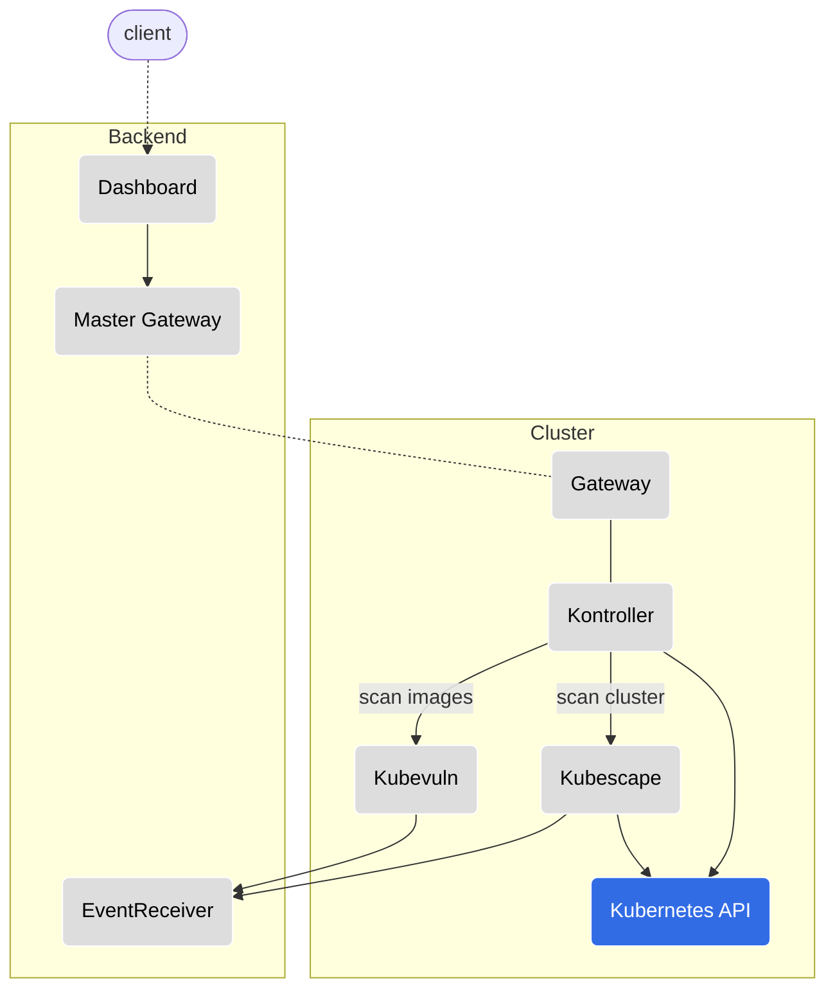
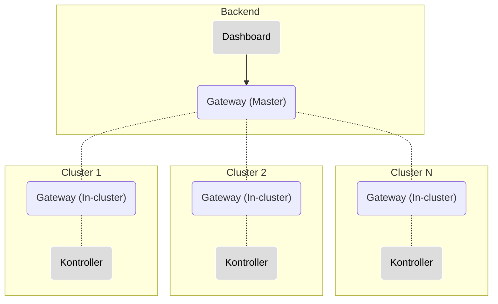
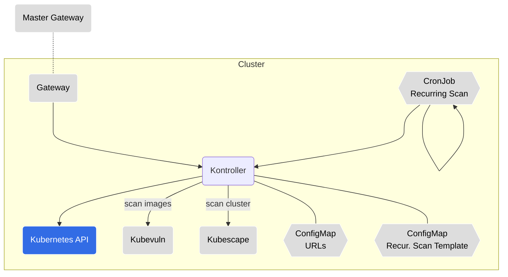
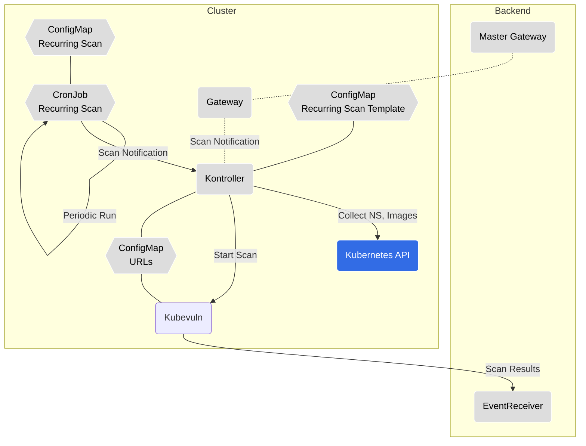
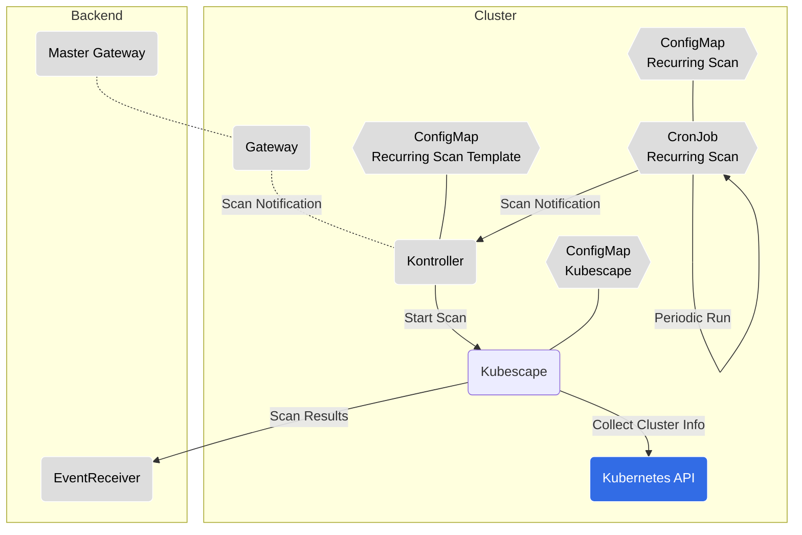
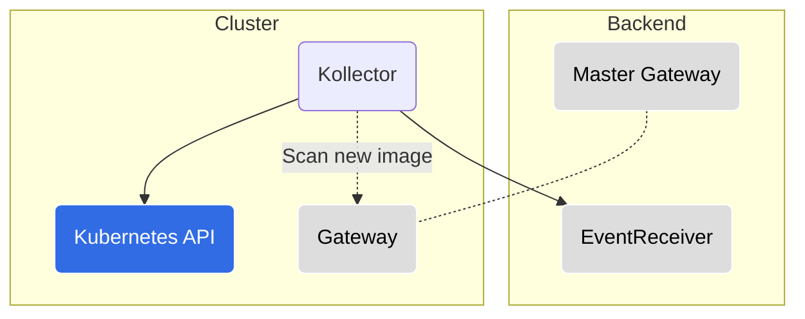
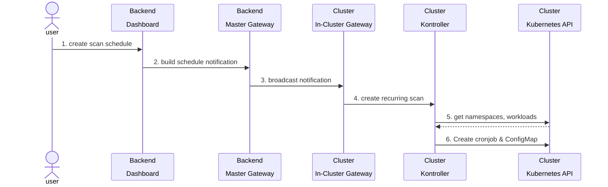
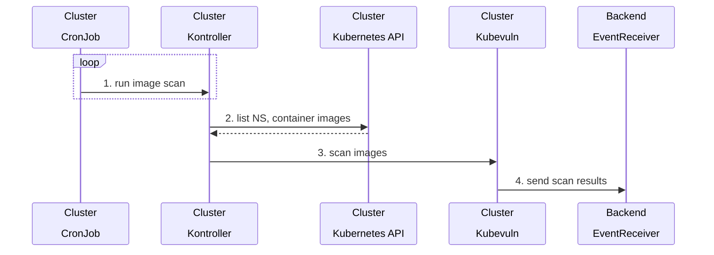
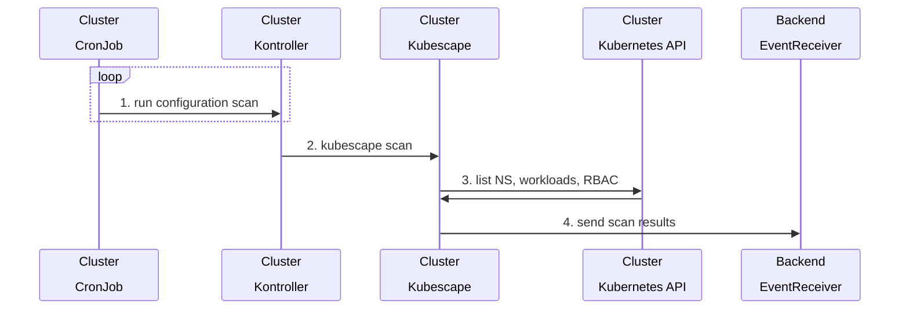

# ARMO cluster components
ARMO Vulnerability Scanning

  

## [Docs](https://hub.armosec.io/docs/installation-of-armo-in-cluster)

## Installing ARMO cluster components in a Kubernetes cluster Using Helm:

1. Add the Vulnerability Scanning Helm Repo
```
helm repo add armo https://armosec.github.io/armo-helm/
```

2. Update helm repo
```
helm repo update
```

3. Install the Helm Chart, use your account ID and give your cluster a name 

if you ran kubescape cli tool and submitted, you can get your Account ID from the local cache: 
```
kubescape config view | grep -i accountID
```
Otherwise, get the account ID from the [kubescape SaaS](https://hub.armosec.io/docs/installation-of-armo-in-cluster#install-a-pre-registered-cluster)

Run the install command:
```
helm upgrade --install armo  armo/armo-cluster-components -n armo-system --create-namespace --set accountGuid=<my_account_guid> --set clusterName=`kubectl config current-context` 
```

> Add `--set clientID=<generated client id> --set secretKey=<generated secret key>` if you have [generated an auth key](https://hub.armosec.io/docs/authentication)

> Add `--set armoKubescape.serviceMonitor.enabled=true` for installing the Prometheus service monitor, [read more about Prometheus integration](https://hub.armosec.io/docs/prometheus-exporter)
 
## Chart support

### Values

| Key | Type | Default | Description |
|-----|------|---------|-------------|
| armoCollector.affinity | object | `{}` | Assign custom [affinity](https://kubernetes.io/docs/concepts/scheduling-eviction/assign-pod-node/) rules to the StatefulSet |
| armoCollector.enabled | bool | `true` | enable/disable the armoCollector |
| armoCollector.env[0] | object | `{"name":"PRINT_REPORT","value":"false"}` | print in verbose mode (print all reported data) |
| armoCollector.image.repository | string | `"quay.io/kubescape/kollector"` | [source code](https://github.com/kubescape/kollector) |
| armoCollector.nodeSelector | object | `{}` | [Node selector](https://kubernetes.io/docs/concepts/scheduling-eviction/assign-pod-node/) |
| armoCollector.volumes | object | `[]` | Additional volumes for the collector |
| armoCollector.volumeMounts | object | `[]` | Additional volumeMounts for the collector |
| armoKubescape.affinity | object | `{}` | Assign custom [affinity](https://kubernetes.io/docs/concepts/scheduling-eviction/assign-pod-node/) rules to the deployment |
| armoKubescape.downloadArtifacts | bool | `true` | download policies every scan, we recommend it should remain true, you should change to 'false' when running in an air-gapped environment or when scanning with high frequency (when running with Prometheus) |
| armoKubescape.enableHostScan | bool | `true` | enable [host scanner feature](https://hub.armosec.io/docs/host-sensor) |
| armoKubescape.enabled | bool | `true` | enable/disable kubescape scanning |
| armoKubescape.image.repository | string | `"quay.io/armosec/kubescape"` | [source code](https://github.com/armosec/kubescape/tree/master/httphandler) (public repo) |
| armoKubescape.nodeSelector | object | `{}` | [Node selector](https://kubernetes.io/docs/concepts/scheduling-eviction/assign-pod-node/) |
| armoKubescape.serviceMonitor.enabled | bool | `false` | enable/disable service monitor for prometheus (operator) integration |
| armoKubescape.skipUpdateCheck | bool | `false` | skip check for a newer version  |
| armoKubescape.submit | bool | `true` | submit results to ARMO SaaS: https://cloud.armosec.io/ |
| armoKubescape.volumes | object | `[]` | Additional volumes for Kubescape |
| armoKubescape.volumeMounts | object | `[]` | Additional volumeMounts for Kubescape |
| armoKubescapeScanScheduler.enabled | bool | `true` | enable/disable a kubescape scheduled scan using a CronJob |
| armoKubescapeScanScheduler.image.repository | string | `"quay.io/armosec/http_request"` | [source code](https://github.com/armosec/http-request) (public repo) |
| armoKubescapeScanScheduler.scanSchedule | string | `"0 0 * * *"` | scan schedule frequency |
| armoKubescapeScanScheduler.volumes | object | `[]` | Additional volumes for scan scheduler |
| armoKubescapeScanScheduler.volumeMounts | object | `[]` | Additional volumeMounts for scan scheduler |
| armoNotificationService.affinity | object | `{}` | Assign custom [affinity](https://kubernetes.io/docs/concepts/scheduling-eviction/assign-pod-node/) rules to the deployment |
| armoNotificationService.enabled | bool | `true` | enable/disable passing notifications from ARMO SaaS to the armo-web-socket microservice. The notifications are the onDemand scanning and the scanning schedule settings |
| armoNotificationService.image.repository | string | `"quay.io/kubescape/gateway"` | [source code](https://github.com/kubescape/gateway) |
| armoNotificationService.nodeSelector | object | `{}` | [Node selector](https://kubernetes.io/docs/concepts/scheduling-eviction/assign-pod-node/) |
| armoNotificationService.volumes | object | `[]` | Additional volumes for the notification service |
| armoNotificationService.volumeMounts | object | `[]` | Additional volumeMounts for the notification service |
| armoVulnScanner.affinity | object | `{}` | Assign custom [affinity](https://kubernetes.io/docs/concepts/scheduling-eviction/assign-pod-node/) rules to the deployment |
| armoVulnScanner.enabled | bool | `true` | enable/disable image vulnerability scanning |
| armoVulnScanner.image.repository | string | `"quay.io/kubescape/kubevuln"` | [source code](https://github.com/kubescape/kubevuln) |
| armoVulnScanner.nodeSelector | object | `{}` | [Node selector](https://kubernetes.io/docs/concepts/scheduling-eviction/assign-pod-node/) |
| armoVulnScanner.volumes | object | `[]` | Additional volumes for the image vulnerability scanning |
| armoVulnScanner.volumeMounts | object | `[]` | Additional volumeMounts for the image vulnerability scanning |
| armoVulnScanScheduler.enabled | bool | `true` | enable/disable a image vulnerability scheduled scan using a CronJob |
| armoVulnScanScheduler.image.repository | string | `"quay.io/armosec/http_request"` | [source code](https://github.com/armosec/http-request) (public repo) |
| armoVulnScanScheduler.scanSchedule | string | `"0 0 * * *"` | scan schedule frequency |
| armoVulnScanScheduler.volumes | object | `[]` | Additional volumes for scan scheduler |
| armoVulnScanScheduler.volumeMounts | object | `[]` | Additional volumeMounts for scan scheduler |
| armoWebsocket.affinity | object | `{}` | Assign custom [affinity](https://kubernetes.io/docs/concepts/scheduling-eviction/assign-pod-node/) rules to the deployment |
| armoWebsocket.enabled | bool | `true` | enable/disable kubescape and image vulnerability scanning |
| armoWebsocket.image.repository | string | `"quay.io/kubescape/kontroller"` | [source code](https://github.com/kubescape/kontroller) |
| armoWebsocket.nodeSelector | object | `{}` | [Node selector](https://kubernetes.io/docs/concepts/scheduling-eviction/assign-pod-node/) |
| armoWebsocket.volumes | object | `[]` | Additional volumes for the web socket |
| armoWebsocket.volumeMounts | object | `[]` | Additional volumeMounts for the web socket |
| armoKubescapeHostScanner.volumes | object | `[]` | Additional volumes for the host scanner |
| armoKubescapeHostScanner.volumeMounts | object | `[]` | Additional volumeMounts for the host scanner |
| aws_iam_role_arn | string | `nil` | AWS IAM arn role |
| clientID | string | `""` | client ID, [read more](https://hub.armosec.io/docs/authentication) |
| addRevisionLabel | bool | `true` | Add revision label to the components. This will insure the components will restart when updating the helm |
| cloudRegion | string | `nil` | cloud region |
| cloud_provider_engine | string | `nil` | cloud provider engine |
| gkeProject | string | `nil` | GKE project |
| gke_service_account | string | `nil` | GKE service account |
| secretKey | string | `""` | secret key, [read more](https://hub.armosec.io/docs/authentication) |
| triggerNewImageScan | bool | `false` | enable/disable trigger image scan for new images |
| volumes | object | `[]` | Additional volumes for all containers |
| volumeMounts | object | `[]` | Additional volumeMounts for all containers |


# In-cluster components overview

An overview of each in-cluster component which is part of the Kubescpae platform helm chart.
Follow the repository link for in-depth information on a specific component.

---

## High-level Architecture Diagram



---

## [Gateway](https://github.com/kubescape/gateway)

* __Resource Kind:__ `Deployment`
* __Communication:__ REST API, Websocket
* __Responsibility:__ Broadcasts a message received to its registered clients. When a client registers itself in a Gateway it must provide a set of attributes, which will serve as identification, for message routing purposes.

  In our architecture, the Gateway acts both as a server and a client, depending on its running configuration:
  * Master Gateway: Refers to the instance running in the backend. Broadcasts messages to all of its registered Gateways.
  * In-cluster Gateway: Refers to the instance running in the cluster. Registered to the Master Gateway using a websocket; Broadcasts messages to the different in-cluster components, this enables executing actions in runtime.

  A Master Gateway communicates with multiple in-cluster Gateways, hence it is able to communicate with multiple clusters.

<details><summary>Component Diagram</summary>



</details>

---

## [Kontroller](https://github.com/kubescape/kontroller)

* __Resource Kind:__ `Deployment`
* __Communication:__ REST API, Websocket
* __Responsibility:__ The Kontroller component is at the heart of the solution as it is the triggering engine for the different actions in the cluster; It responds to REST API requests and messages received over websocket connection, and triggers the relevant action in the cluster. Such actions could be triggering a configuration scan, image vulnerability scan, defining a recurring scan (by creating CronJobs), etc.

<details><summary>Component Diagram</summary>



</details>

---

## [Kubevuln](https://github.com/kubescape/kubevuln/)

* __Resource Kind:__ `Deployment`
* __Communication:__ REST API
* __Responsibility:__ Scans container images for vulnerabilities, using [Grype](https://github.com/anchore/grype) as its engine.

<details><summary>Component Diagram</summary>


</details>

---

## [Kubescape](https://github.com/armosec/kubescape/tree/master/httphandler)

* __Resource Kind:__ `Deployment`
* __Communication:__ REST API
* __Responsibility:__ Runs [Kubescape](https://github.com/armosec/kubescape) for detecting misconfigurations in the cluster; This is microservice uses the same engine as the Kubescape CLI tool.

<details><summary>Component Diagram</summary>



</details>

---

## [Kollector](https://github.com/kubescape/kollector)

* __Resource Kind:__ `StatefulSet`
* __Responsibility:__ Communicates with the Kubernetes API server to collect cluster information and watches for changes in the cluster. Information is reported to the backend via the EventReceiver and the Gateway.

<details><summary>Component Diagram</summary>



</details>

---

## [URLs ConfigMap](https://github.com/armosec/armo-helm/blob/master/charts/armo-components/templates/armo-configmap.yaml)

Holds a list of communication URLs. Used by the following components:

* Kontroller
* Kubevuln
* Gateway

<details><summary>Config Example (YAML)</summary>

```yaml
gatewayWebsocketURL: 127.0.0.1:8001                             # component: in-cluster gateway
gatewayRestURL: 127.0.0.1:8002                                  # component: in-cluster gateway
kubevulnURL: 127.0.0.1:8081                                     # component: kubevuln
kubescapeURL: 127.0.0.1:8080                                    # component: kubescape
eventReceiverRestURL: https://report.cloud.com                  # component: eventreceiver
eventReceiverWebsocketURL: wss://report.cloud.com               # component: eventreceiver
rootGatewayURL: wss://masterns.cloud.com/v1/waitfornotification # component: master gateway
accountID: 1111-aaaaa-4444-555
clusterName: minikube
```
</details>

---

## Kubernetes API

Some in-cluster components communicate with the Kubernetes API server for different purposes:

* Kollector

  Watches for changes in namespace, workloads, nodes. Reports information to the EventReceiver. Identifies image-related changes and triggers an image scanning on the new images accordingly (scanning new images functionality is optional).

* Kontroller

  Creates/updates/deletes resources for recurring scan purposes (CronJobs, ConfigMaps). Collects required information (NS, image names/tags) for Kubevuln's image scanning.

* Kubescape

  Collects namespaces, workloads, RBAC etc. required for cluster scans.

---

## Backend components

The backend components are running in [Kubescape's SaaS offering](https://cloud.armosec.io/).

### Dashboard

* REST API service

### EventReceiver

* __Responsibility:__ Receive and process Kubescape & Kubevuln scan results.
* __Communication:__ REST API

---

## Logging and troubleshooting

Each component writes logs to the standard output.

Every action has a generated `jobId` which is written to the log.

An action which creates sub-action(s), will be created with a different `jobId` but with a `parentId` which will correlate to the parent action's `jobId`.

---

## Recurring scans

3 types of recurring scans are supported:

  1. Cluster configuration scanning (Kubescape)
  2. Vulnerability scanning for container images (Kubevuln)
  3. Container registry scanning (Kubevuln)

When creating a recurring scan, the Kontroller component will create a `ConfigMap` and a `CronJob` from a recurring template ConfigMap. Each scan type comes with a template.

The CronJob itself does not run the scan directly. When a CronJob is ready to run, it will send a REST API request to the Kontroller component, which will then trigger the relevant scan (similarly to a request coming from the Gateway).

The scan results are then sent by each relevant component to the EventReceiver.

### Main Flows Diagrams

<details><summary>Recurring Scan Creation</summary>



</details>

<details><summary>Recurring Image Scan</summary>



</details>

<details><summary>Recurring Kubescape Scan</summary>



</details>