# Kubescape Operator

  

## Install

Run the install command:
```
helm repo update ; helm upgrade --install kubescape kubescape/kubescape-operator -n kubescape --create-namespace --set clusterName=`kubectl config current-context` --set capabilities.continuousScan=enable
```

Verify that the installation was successful:
```shell
$ kubectl get pods -n kubescape
kubescape     kubescape-548d6b4577-qshb5                          1/1     Running   0               60m
kubescape     kubevuln-6779c9d74b-wfgqf                           1/1     Running   0               60m
kubescape     operator-5d745b5b84-ts7zq                           1/1     Running   0               60m
kubescape     storage-59567854fd-hg8n8                            1/1     Running   0               60m
```
## View results

The scanning results will be available gradually as the scans are completed.

View your configuration scan summaries:
```
kubectl get workloadconfigurationscansummaries -A
```

Detailed reports are also available:
```
kubectl get workloadconfigurationscans -A
```

View your image vulnerabilities scan summaries:
```
kubectl get vulnerabilitymanifestsummaries -A
```

Detailed reports are also available:
```
kubectl get vulnerabilitymanifests -A
```

## Uninstall

You can uninstall this helm chart by running the following command:
```
helm uninstall kubescape -n kubescape
```
Then, delete the kubescape namespace:
```shell  
kubectl delete ns kubescape
```

### Adjusting Resource Usage for Your Cluster

By default, Kubescape is configured for small- to medium-sized clusters.
If you have a larger cluster and you experience slowdowns or see Kubernetes evicting components, please revise the amount of resources allocated for the troubled component.

Taking Kubescape for example, we found that our defaults of 500 MiB of memory and 500m CPU work well for clusters up to 1250 total resources.
If you have more total resources or experience resource pressure already, first check out how many resources are in your cluster by running the following command:

```
kubectl get all -A --no-headers | wc -l
```

The command should print an approximate count of resources in your cluster.
Then, based on the number you see, allocate 100 MiB of memory for every 200 resources in your cluster over the count of 1250, but no less than 128 MiB total.
The formula for memory is as follows:
```
MemoryLimit := max(128, 0.4 * YOUR_AMOUNT_OF_RESOURCES)
```

For example, if your cluster has 500 resources, a sensible memory limit would be:
```
kubescape:
  resources:
    limits:
      memory: 200Mi  # max(128, 0.4 * 500) == 200
```
If your cluster has 50 resources, we still recommend allocating at least 128 MiB of memory.

Regarding CPU, the more you allocate, the faster Kubescape will scan your cluster.
This is especially true for clusters that have a large amount of resources.
However, we recommend that you give Kubescape no less than 500m CPU no matter the size of your cluster so it can scan a relatively large amount of resources fast ;)

### Setting up Telemetry
Several of Kubescape's in-cluster components implement telemetry data using [OpenTelemetry](https://opentelemetry.io/) (otel).
You can optionally install an otel [collector](https://opentelemetry.io/docs/collector/) to your cluster to aggregate all metrics and send them to your own tracing tool.

You simply have to fill in this information before [installing kubescape operator](#installing-kubescape-operator-in-a-kubernetes-cluster-using-helm):
```
otelCollector:
  enabled: true
  endpoint:
    host: <ip or dns for your gRPC otel endpoint>
    port: 4317
    insecure: <whether your otel endpoint requires ssl>
    headers: <optional - map of headers required by tracing tool>
```

If you don't have an otel distribution, we suggest you try either [Uptrace](https://github.com/uptrace/uptrace/tree/master/example/docker) or [SigNoz](https://signoz.io/docs/install/docker/)
as they are free, opensource and can be quickly deployed using docker-compose.

#### Host metrics collection

The OpenTelemetry collector is configured with the [`hostmetrics`](https://github.com/open-telemetry/opentelemetry-collector-contrib/blob/main/receiver/hostmetricsreceiver/README.md) receiver to collect CPU and memory utilization metrics.

Note that the hostmetrics receiver is disabled by default. If you wish to enable it, simply install the operator with `--set otelCollector.hostmetrics.enabled=true`

#### Example: exporting to uptrace running inside docker-compose

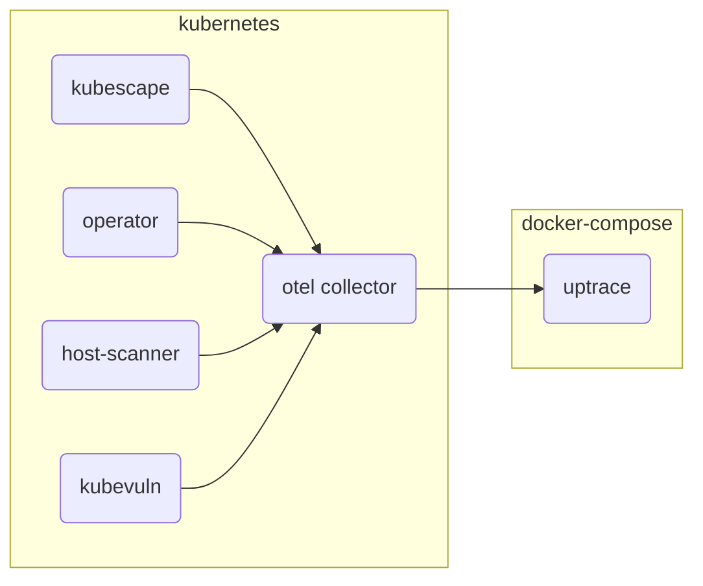

1. Download the example using Git:

```shell
git clone https://github.com/uptrace/uptrace.git
cd uptrace/example/docker
```

2. Start the services using Docker:

```shell
docker-compose pull
docker-compose up -d
```

3. Make sure Uptrace is running:

```shell
docker-compose logs uptrace
```

4. Follow the [instructions above](#installing-kubescape-operator-in-a-kubernetes-cluster-using-helm), add the OTEL collector configuration and install the operator as follows:
  
  ```
  --set configurations.otelUrl=<collector host>:14317 --set otelCollector.endpoint.insecure=false
  ```

5. Open Uptrace UI at [http://localhost:14318/overview/2](http://localhost:14318/overview/2)


## Chart support

### Values

| Key | Type | Default | Description |
|-----|------|---------|-------------|
| global.networkPolicy.enabled | bool | `false` | Create NetworkPolicies for all components |
| global.networkPolicy.createEgressRules | bool | `false` | Create common Egress rules for NetworkPolicies |
| global.kubescapePsp.enabled | bool | `false` | Enable all privileges in Pod Security Policies for Kubescape namespace |
| global.httpsProxy | string | `""` | Set https egress proxy for all components. Must supply also port.  |
| global.proxySecretFile | string | `""` | Set proxy certificate / RootCA for all components to be used for proxy configured in global.httpsProxy |
| credentials.cloudSecret | string | `""` | Leave it blank for the default secret. If you have an existing secret, override with the existing secret name to avoid Helm creating a default one |
| kollector.affinity | object | `{}` | Assign custom [affinity](https://kubernetes.io/docs/concepts/scheduling-eviction/assign-pod-node/) rules to the StatefulSet |
| kollector.env[0] | object | `{"name":"PRINT_REPORT","value":"false"}` | print in verbose mode (print all reported data) |
| kollector.image.repository | string | `"quay.io/kubescape/kollector"` | [source code](https://github.com/kubescape/kollector) |
| kollector.nodeSelector | object | `{}` | [Node selector](https://kubernetes.io/docs/concepts/scheduling-eviction/assign-pod-node/) |
| kollector.volumes | object | `[]` | Additional volumes for the collector |
| kollector.volumeMounts | object | `[]` | Additional volumeMounts for the collector |
| kubescape.affinity | object | `{}` | Assign custom [affinity](https://kubernetes.io/docs/concepts/scheduling-eviction/assign-pod-node/) rules to the deployment |
| kubescape.downloadArtifacts | bool | `true` | download policies every scan, we recommend it should remain true, you should change to 'false' when running in an air-gapped environment or when scanning with high frequency (when running with Prometheus) |
| kubescape.enableHostScan | bool | `true` | enable [host scanner feature](https://hub.armosec.io/docs/host-sensor) |
| kubescape.image.repository | string | `"quay.io/kubescape/kubescape"` | [source code](https://github.com/kubescape/kubescape/tree/master/httphandler) (public repo) |
| kubescape.nodeSelector | object | `{}` | [Node selector](https://kubernetes.io/docs/concepts/scheduling-eviction/assign-pod-node/) |
| kubescape.serviceMonitor.enabled | bool | `false` | enable/disable service monitor for prometheus (operator) integration |
| kubescape.skipUpdateCheck | bool | `false` | skip check for a newer version |
| kubescape.labels | `[]` | adds labels to the kubescape microservice |
| kubescape.submit | bool | `true` | submit results to Kubescape SaaS: https://cloud.armosec.io/ |
| kubescape.volumes | object | `[]` | Additional volumes for Kubescape |
| kubescape.volumeMounts | object | `[]` | Additional volumeMounts for Kubescape |
| kubescapeScheduler.enabled | bool | `true` | enable/disable a kubescape scheduled scan using a CronJob |
| kubescapeScheduler.image.repository | string | `"quay.io/kubescape/http_request"` | [source code](https://github.com/kubescape/http-request) (public repo) |
| kubescapeScheduler.scanSchedule | string | `"0 0 * * *"` | scan schedule frequency |
| kubescapeScheduler.volumes | object | `[]` | Additional volumes for scan scheduler |
| kubescapeScheduler.volumeMounts | object | `[]` | Additional volumeMounts for scan scheduler |
| gateway.affinity | object | `{}` | Assign custom [affinity](https://kubernetes.io/docs/concepts/scheduling-eviction/assign-pod-node/) rules to the deployment |
| gateway.image.repository | string | `"quay.io/kubescape/gateway"` | [source code](https://github.com/kubescape/gateway) |
| gateway.nodeSelector | object | `{}` | [Node selector](https://kubernetes.io/docs/concepts/scheduling-eviction/assign-pod-node/) |
| gateway.volumes | object | `[]` | Additional volumes for the notification service |
| gateway.volumeMounts | object | `[]` | Additional volumeMounts for the notification service |
| kubevuln.affinity | object | `{}` | Assign custom [affinity](https://kubernetes.io/docs/concepts/scheduling-eviction/assign-pod-node/) rules to the deployment |
| kubevuln.image.repository | string | `"quay.io/kubescape/kubevuln"` | [source code](https://github.com/kubescape/kubevuln) |
| kubevuln.nodeSelector | object | `{}` | [Node selector](https://kubernetes.io/docs/concepts/scheduling-eviction/assign-pod-node/) |
| kubevuln.volumes | object | `[]` | Additional volumes for the image vulnerability scanning |
| kubevuln.volumeMounts | object | `[]` | Additional volumeMounts for the image vulnerability scanning |
| kubevulnScheduler.enabled | bool | `true` | enable/disable an image vulnerability scheduled scan using a CronJob |
| kubevulnScheduler.image.repository | string | `"quay.io/kubescape/http_request"` | [source code](https://github.com/kubescape/http-request) (public repo) |
| kubevulnScheduler.scanSchedule | string | `"0 0 * * *"` | scan schedule frequency |
| kubevulnScheduler.volumes | object | `[]` | Additional volumes for scan scheduler |
| kubevulnScheduler.volumeMounts | object | `[]` | Additional volumeMounts for scan scheduler |
| operator.affinity | object | `{}` | Assign custom [affinity](https://kubernetes.io/docs/concepts/scheduling-eviction/assign-pod-node/) rules to the deployment |
| operator.image.repository | string | `"quay.io/kubescape/operator"` | [source code](https://github.com/kubescape/operator) |
| operator.nodeSelector | object | `{}` | [Node selector](https://kubernetes.io/docs/concepts/scheduling-eviction/assign-pod-node/) |
| operator.volumes | object | `[]` | Additional volumes for the web socket |
| operator.volumeMounts | object | `[]` | Additional volumeMounts for the web socket |
| hostScanner.volumes | object | `[]` | Additional volumes for the host scanner |
| hostScanner.volumeMounts | object | `[]` | Additional volumeMounts for the host scanner |
| awsIamRoleArn | string | `nil` | AWS IAM arn role |
| cloudProviderMetadata.cloudRegion | string | `nil` | cloud region |
| cloudProviderMetadata.gkeProject | string | `nil` | GKE project |
| cloudProviderMetadata.gkeServiceAccount | string | `nil` | GKE service account |
| cloudProviderMetadata.aksSubscriptionID | string | `nil` | AKS subscription ID |
| cloudProviderMetadata.aksResourceGroup | string | `nil` | AKS resource group |
| cloudProviderMetadata.aksClientID | string | `nil` | AKS client ID |
| cloudProviderMetadata.aksClientSecret | string | `nil` | AKS client secret |
| cloudProviderMetadata.aksTenantID | string | `nil` | AKS tenant ID |
| triggerNewImageScan | bool | `false` | enable/disable trigger image scan for new images |
| volumes | object | `[]` | Additional volumes for all containers |
| volumeMounts | object | `[]` | Additional volumeMounts for all containers |


# In-cluster components overview

An overview of each in-cluster component which is part of the Kubescape platform helm chart.
Follow the repository link for in-depth information on a specific component.

---

## High-level Architecture Diagram

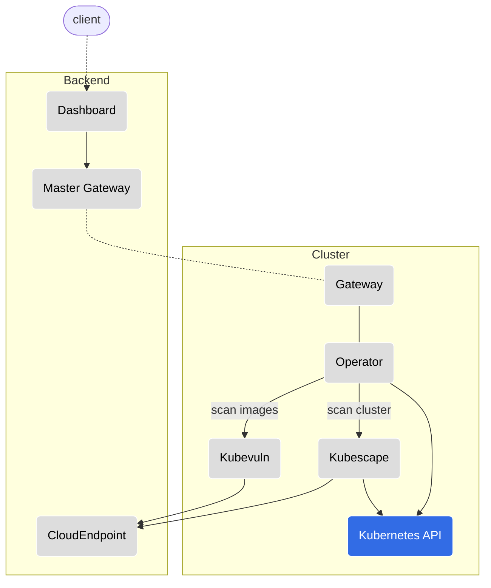

---

## [Gateway](https://github.com/kubescape/gateway)

* __Resource Kind:__ `Deployment`
* __Communication:__ REST API, Websocket
* __Responsibility:__ Broadcasts a message received to its registered clients. When a client registers itself in a Gateway it must provide a set of attributes, which will serve as identification, for message routing purposes.

  In our architecture, the Gateway acts both as a server and a client, depending on its running configuration:
  * Master Gateway: Refers to the instance running in the backend. Broadcasts messages to all of its registered Gateways.
  * In-cluster Gateway: Refers to the instance running in the cluster. Registered to the Master Gateway using a websocket; Broadcasts messages to the different in-cluster components, this enables executing actions in runtime.

  A Master Gateway communicates with multiple in-cluster Gateways, hence it is able to communicate with multiple clusters.

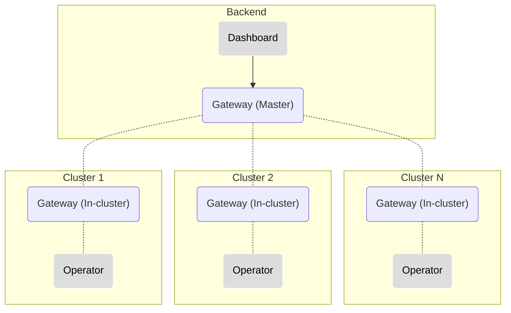

---

## [Operator](https://github.com/kubescape/operator)

* __Resource Kind:__ `Deployment`
* __Communication:__ REST API, Websocket
* __Responsibility:__ The Operator component is at the heart of the solution as it is the triggering engine for the different actions in the cluster; It responds to REST API requests and messages received over websocket connection, and triggers the relevant action in the cluster. Such actions could be triggering a configuration scan, image vulnerability scan, defining a recurring scan (by creating CronJobs), etc.

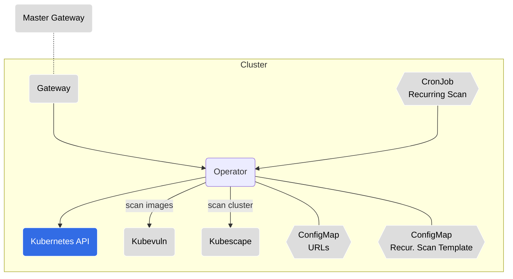

---

## [Kubevuln](https://github.com/kubescape/kubevuln/)

* __Resource Kind:__ `Deployment`
* __Communication:__ REST API
* __Responsibility:__ Scans container images for vulnerabilities, using [Grype](https://github.com/anchore/grype) as its engine.

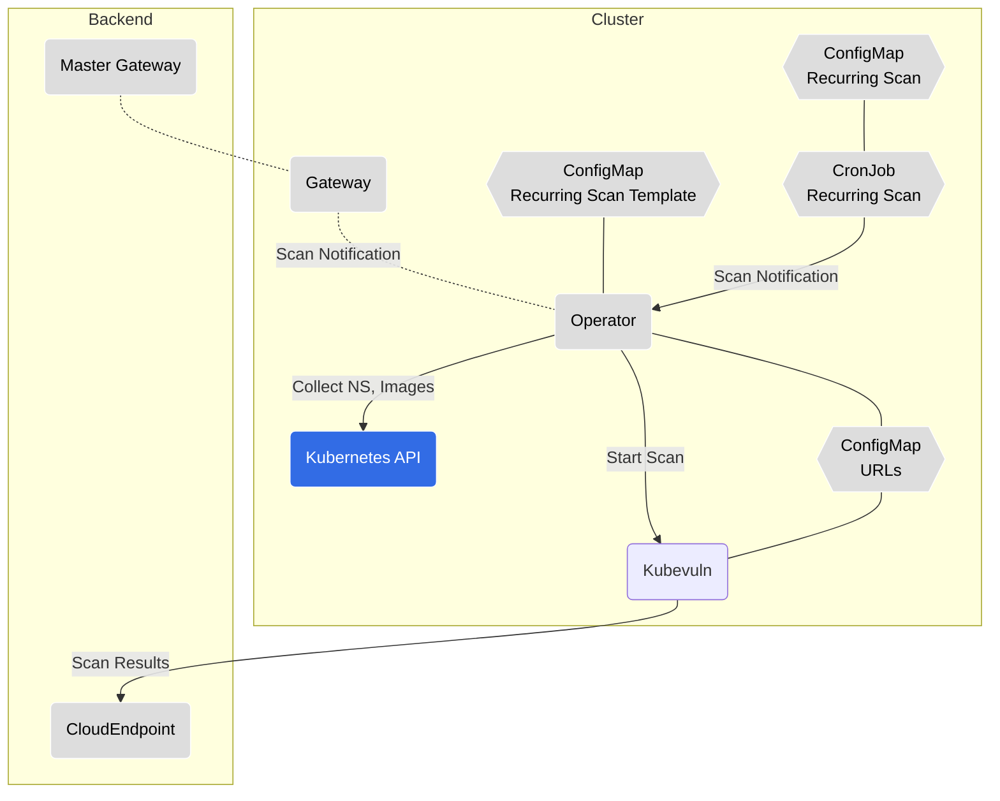

---

## [Kubescape](https://github.com/kubescape/kubescape/tree/master/httphandler)

* __Resource Kind:__ `Deployment`
* __Communication:__ REST API
* __Responsibility:__ Runs [Kubescape](https://github.com/kubescape/kubescape) for detecting misconfigurations in the cluster; This is microservice uses the same engine as the Kubescape CLI tool.

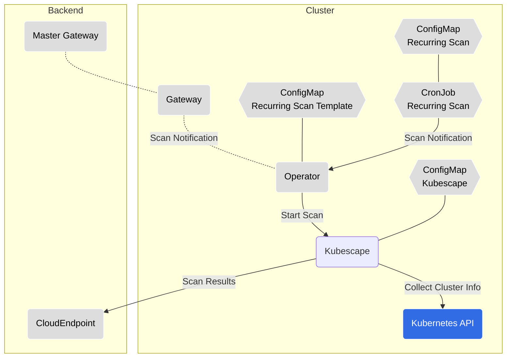

---

## [Kollector](https://github.com/kubescape/kollector)

* __Resource Kind:__ `StatefulSet`
* __Responsibility:__ Communicates with the Kubernetes API server to collect cluster information and watches for changes in the cluster. Information is reported to the backend via the CloudEndpoint and the Gateway.

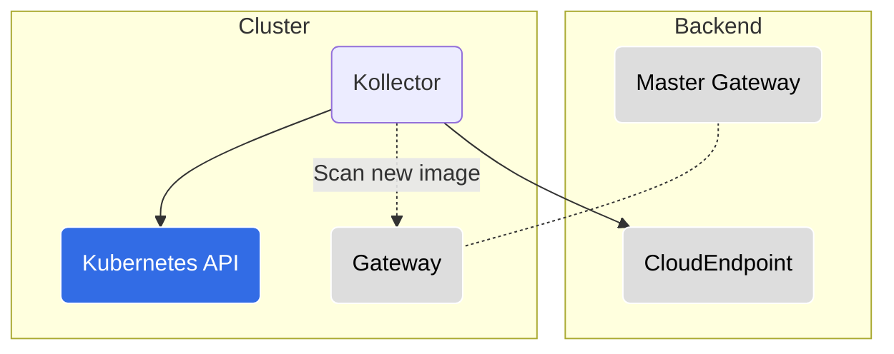

---

## [URLs ConfigMap](https://github.com/kubescape/helm-charts/blob/master/charts/kubescape-operator/templates/cloudapi-configmap.yaml)

Holds a list of communication URLs. Used by the following components:

* Operator
* Kubevuln
* Gateway

<details><summary>Config Example (YAML)</summary>

```yaml
gatewayWebsocketURL: 127.0.0.1:8001                             # component: in-cluster gateway
gatewayRestURL: 127.0.0.1:8002                                  # component: in-cluster gateway
kubevulnURL: 127.0.0.1:8081                                     # component: kubevuln
kubescapeURL: 127.0.0.1:8080                                    # component: kubescape
accountID: 1111-aaaaa-4444-555
clusterName: minikube
```
</details>

---

## Kubernetes API

Some in-cluster components communicate with the Kubernetes API server for different purposes:

* Kollector

  Watches for changes in namespace, workloads, and nodes. Reports information to the CloudEndpoint. Identifies image-related changes and triggers an image scanning on the new images accordingly (scanning new images functionality is optional).

* Operator

  Creates/updates/deletes resources for recurring scan purposes (CronJobs, ConfigMaps). Collects required information (NS, image names/tags) for Kubevuln's image scanning.

* Kubescape

  Collects namespaces, workloads, RBAC etc. required for cluster scans.

---

## Backend components

The backend components are running in [Kubescape's SaaS offering](https://cloud.armosec.io/).

### Dashboard

* REST API service

### CloudEndpoint

* __Responsibility:__ Receive and process Kubescape & Kubevuln scan results.
* __Communication:__ REST API

---

## Logging and troubleshooting

Each component writes logs to the standard output.

Every action has a generated `jobId` which is written to the log.

An action which creates sub-action(s), will be created with a different `jobId` but with a `parentId` which will correlate to the parent action's `jobId`.

### Distroless images

Each component is built as a distroless image. This means that the image does not contain any shell or package manager. This is done for security reasons.

In order to troubleshoot a component, you can use the `kubectl debug` command to add an [ephemeral container](https://kubernetes.io/docs/tasks/debug/debug-application/debug-running-pod/#ephemeral-container) to the pod and run a shell in it:

```bash
kubectl -n kubescape debug -it <pod-name> --image=docker.io/busybox --target=<container-name>
```

**Note:** The `--target` parameter must be supported by the Container Runtime.
When not supported, the Ephemeral Container may not be started, or it may be started with an isolated process namespace so that `ps` does not reveal processes in other containers.

Use `kubectl delete` to remove the Pod when you're finished (there is no other way to remove the ephemeral container):

```bash
kubectl -n kubescape delete pod <pod-name>
```

---

## Recurring scans

3 types of recurring scans are supported:

  1. Cluster configuration scanning (Kubescape)
  2. Vulnerability scanning for container images (Kubevuln)
  3. Container registry scanning (Kubevuln)

When creating a recurring scan, the Operator component will create a `ConfigMap` and a `CronJob` from a recurring template ConfigMap. Each scan type comes with a template.

The CronJob itself does not run the scan directly. When a CronJob is ready to run, it will send a REST API request to the Operator component, which will then trigger the relevant scan (similarly to a request coming from the Gateway).

The scan results are then sent by each relevant component to the CloudEndpoint.

### Main Flows Diagrams

<details><summary>Recurring Scan Creation</summary>


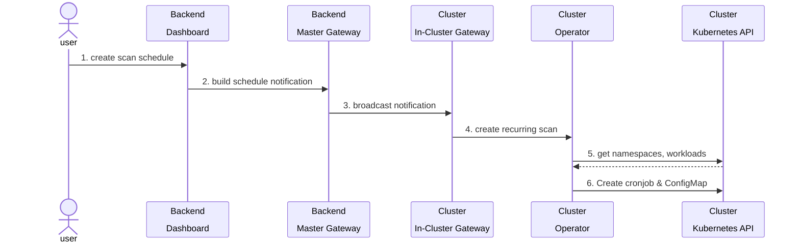
</details>

<details><summary>Recurring Image Scan</summary>

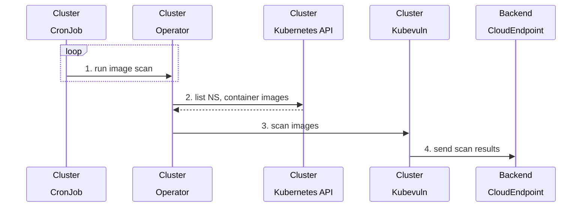

</details>

<details><summary>Recurring Kubescape Scan</summary>

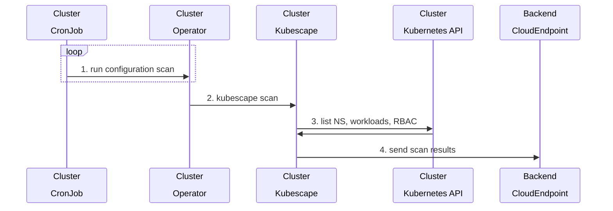

</details>

---

## Kubescape-Prometheus Integration

Most of the end-users either use [`kube-prometheus-stack`](https://github.com/prometheus-community/helm-charts/tree/main/charts/kube-prometheus-stack) Prometheus operator else [`prometheus helm chart`](https://github.com/prometheus-community/helm-charts/tree/main/charts/prometheus) to install Prometheus for monitoring. Based on your choice of Prometheus, you can follow either of the below methods to enable kubescape monitoring with Prometheus.

---

### Kubescape integration with Kube-Prometheus-stack (Prometheus operator):

1. Install the `kube-prometheus-stack` Helm Chart
```
helm repo add prometheus-community https://prometheus-community.github.io/helm-charts
helm repo update
kubectl create namespace prometheus
helm install -n prometheus kube-prometheus-stack prometheus-community/kube-prometheus-stack --set prometheus.prometheusSpec.podMonitorSelectorNilUsesHelmValues=false,prometheus.prometheusSpec.serviceMonitorSelectorNilUsesHelmValues=false
```

2. Install the `kubescape-operator` Helm Chart with `capabilities.prometheusExporter` enabled

```
helm repo add kubescape https://kubescape.github.io/helm-charts/
helm repo update
helm upgrade --install <...> --set capabilities.prometheusExporter=enable
``` 

---

### Kubescape integration with Prometheus community helm chart:

1. Install the `prometheus-community` Helm Chart
```
helm repo add prometheus-community https://prometheus-community.github.io/helm-charts
helm repo update
kubectl create namespace prometheus
helm install -n prometheus prometheus prometheus-community/prometheus
```

2. Install the `kubescape-operator` Helm Chart with `capabilities.prometheusExporter` and `configuration.prometheusAnnotations` enabled

```
helm repo add kubescape https://kubescape.github.io/helm-charts/
helm repo update
helm upgrade --install <...> --set capabilities.prometheusExporter=enable --set configuration.prometheusAnnotations=enable
``` 

---

### Component Diagram

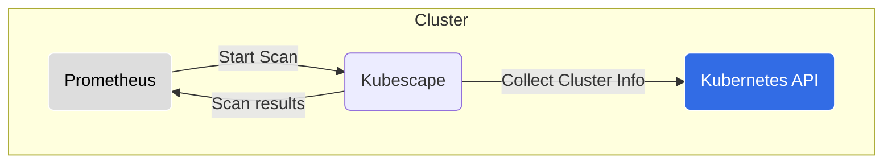

# Automatic Release Upgrade

The Helm chart provides a capability to automatically fetch the latest chart version and upgrade the installed release.

## How to Use

To enable this capability, simply simply set the `capabilities.autoUpgrading` to `enable` and configure how often you would like to check for updates by adjusting the cron schedule:

```yaml
capabilities:
  autoUpgrading: enable

# [Omitted for brevity...]

autoUpgrader:
  schedule: "0 14 * * *"  # Check for updates every day at 14:00
```

Helm will then install the Kubescape Helm Release Upgrader CronJob and its supporting resources.
They will keep your Kubescape release up to date.

> [!WARNING]
> Due to how Helm works, the Helm Release Upgrader requires highly elevated RBAC permissions and leaves orphaned resources even after you uninstall the Kubescape release.

## How it Works

The Auto Upgrading capability is experimental.

It works as follows:
- Creates a cluster admin ClusterRole, ClusterRoleBinding and ServiceAccount to have all the permissions necessary to create resources with Helm.
- Creates a CronJob that updates the local Kubescape Helm repo (`helm repo update`) to fetch the latest chart versions and upgrades the Helm release accordingly (`helm upgrade`).
- To account for Helm removing and re-creating the release resources during `helm upgrade`, it keeps the RBAC definitions and the CronJob in the cluster with `"helm.sh/resource-policy": keep`.

This means:
- The upgrader runs in a very priviledged RBAC context: it can create resources, list Secrets etc.
- Even after you remove the Kubescape release with `helm -n kubescape uninstall kubescape`, it will still keep the highly priviledged RBACs and CronJob in your cluster.

While the CronJob runs in a non-root security context and you can clean up the leftover resources on your own, please evaluate the risks the Release Upgrader introduces against your security needs and threat model.


## How to Clean Up

To clean up the resources left by the Release Upgrader, run the following command:

```
kubectl -n kubescape delete clusterrolebinding/helm-release-upgrader \
    clusterrole/helm-release-upgrader \
    serviceaccount/helm-release-upgrader \
    cj/helm-release-upgrader
```

Once it finishes, you should have no traces of the Release Upgrader in your cluster.


# Continuous Scanning

To let cluster operators see the current security posture of their cluster, Kubescape provides the Continuous Scanning feature. Once enabled, Kubescape will constantly monitor the cluster for changes, evaluate their impact on the overall cluster security and reflect its findings in the cluster-, namespace- and workload-scoped security reports. Essentially, this means you'll always get the latest scoop on your cluster’s security!

## Installation

Continuous Scanning is built into the Kubescape Operator Helm chart. To use this capability, you only need to enable it. Start by navigating to the `values.yaml` file and make sure that the corresponding `capabilities.continuousScan` key is set to `enable`, like so:

```yaml
capabilities:
  continuousScan: enable  # Make sure this is set to "enable"
```

Once you apply the chart with the capability enabled, Kubescape will continuously secure your cluster and provide the scan results as Custom Resources.

## Accessing Results

### For the Whole Cluster

Kubescape provides scan results as Custom Resources so you can access them in the same convenient way you access other Kubernetes objects. Let’s assume you’d like to see a birds-eye view of you cluster’s security. In Kubescape terms, that would mean taking a look at the cluster-level configuration scan summary:

```
kubectl get workloadconfigurationscansummaries -o yaml
```

Running this command will return you a YAML-formatted list of configuration scan summaries for your cluster by namespaces.

On clusters with many namespaces, the results might be overwhelming and might even exceed your terminal history. Since Kubescape serves results as Kubernetes objects, which are YAML files at its core, you can do your usual tricks: pipe them to files, text editors etc. A trick we commonly use is:

```
kubectl get workloadconfigurationscansummaries -o yaml | less
```

This way you get the entire results and browse the file as you see fit.

### By Namespace

Let’s say you have a namespace `k8s-bad-practices`. It runs badly misconfigured insecure workloads and you would like to see how Kubescape sees them. To get the configuration scan results for this namespace, run the following command:

```
kubectl get -n k8s-bad-practices workloadconfigurationscansummaries -o yaml | less
```

You should see a summary for the insecure namespace only.

### By Workload

You could also be interested in checking how secure a specific workload is. To see the results, use:

```
kubectl get -n k8s-bad-practices workloadconfigurationscansummaries trusty-reverse-proxy -o yaml | less
```

That should provide you with a configuration scan summary for this workload.

## How It Works

With Continuous Scanning enabled, Kubescape continuously monitors a cluster for changes, determines how they affect the security of your cluster and reflect their security impact in the overall cluster’s security report, as well as individual workload security reports. Let’s take a look at a sequence diagram.


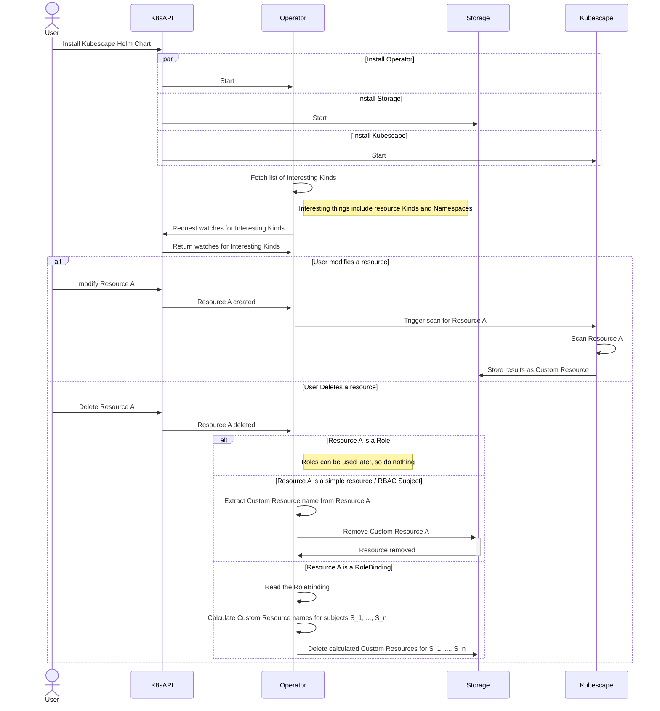

# Network Policy generation (beta)

Disclaimer: Please note that this feature is currently in BETA and it's disabled by default.  

Creating Network Policies for workloads running in a cluster is a very important step in securing your cluster. But doing so manually can be a very tedious and error-prone task.   
Kubescape provides a way to automatically generate Network Policies for your cluster. Once the Network Policy generation feature is enabled, Kubescape will listen to the network communication on your workloads, and you can then use `kubectl` to generate Network Policies automatically based on the captured traffic. Please note that the policies won't be applied to the cluster automatically. You will have to apply them manually.

## Installation 
Kubescape Network Policy generation is built into the Kubescape Operator Helm chart. To use this capability, you need to enable it. Start by navigating to the `values.yaml` file and make sure that the corresponding `capabilities.networkPolicyService` key is set to `enable`, like so:
```yaml
capabilities:
  networkPolicyService: enable  # Make sure this is set to "enable"
```

Once you apply the chart with the capability enabled, Kubescape will continuously listen to the workloads traffic and you could then generate network policies for them.

## Network Policy generation

To generate a Network Policy for a workload, all you need to do is run the following command:
```
kubectl -n <namespace> get generatednetworkpolicies <workload-kind>-<workload-name> -o yaml
```
For example, if you want to generate a Network Policy for a `Deployment` named `nginx` in the `default` namespace, you would run the following command:
```
kubectl -n default get generatednetworkpolicies deployment-nginx -o yaml
```
This will return you a CRD of Kind `GeneratedNetworkPolicy`. This CRD will contain on its `spec` the generated Network Policy. You can then apply this Network Policy to your cluster.

This is an example of a generated CRD:
```yaml
apiVersion: spdx.softwarecomposition.kubescape.io/v1beta1
kind: GeneratedNetworkPolicy
metadata:
  creationTimestamp: "2023-12-12T08:46:30Z"
  labels:
    kubescape.io/workload-api-group: apps
    kubescape.io/workload-api-version: v1
    kubescape.io/workload-kind: deployment
    kubescape.io/workload-name: operator
    kubescape.io/workload-namespace: kubescape
    kubescape.io/workload-resource-version: "76459062"
  name: deployment-operator
  namespace: kubescape
policyRef:
- dns: report.armo.cloud.
  ipBlock: 16.171.184.118/32
  name: ""
  originalIP: 16.171.184.118
  server: ""
spec:
  apiVersion: networking.k8s.io/v1
  kind: NetworkPolicy
  metadata:
    annotations:
      generated-by: kubescape
    creationTimestamp: null
    labels:
      kubescape.io/workload-api-group: apps
      kubescape.io/workload-api-version: v1
      kubescape.io/workload-kind: deployment
      kubescape.io/workload-name: operator
      kubescape.io/workload-namespace: kubescape
      kubescape.io/workload-resource-version: "76459062"
    name: deployment-operator
    namespace: kubescape
  spec:
    egress:
    - ports:
      - port: 4317
        protocol: TCP
      to:
      - podSelector:
          matchLabels:
            app: otel-collector
    - ports:
      - port: 8001
        protocol: TCP
      to:
      - podSelector:
          matchLabels:
            app: gateway
    - ports:
      - port: 8080
        protocol: TCP
      to:
      - podSelector:
          matchLabels:
            app: kubescape
    - ports:
      - port: 443
        protocol: TCP
      to:
      - ipBlock:
          cidr: 16.171.184.118/32
    - ports:
      - port: 53
        protocol: UDP
      to:
      - namespaceSelector:
          matchLabels:
            kubernetes.io/metadata.name: kube-system
        podSelector:
          matchLabels:
            k8s-app: kube-dns
    - ports:
      - port: 8080
        protocol: TCP
      to:
      - podSelector:
          matchLabels:
            app: kubevuln
    - ports:
      - port: 443
        protocol: TCP
      to:
      - ipBlock:
          cidr: 10.128.0.90/32
    podSelector:
      matchLabels:
        app.kubernetes.io/instance: kubescape
        app.kubernetes.io/name: operator
        tier: ks-control-plane
    policyTypes:
    - Egress
```

`spec` - contains the Kubernetes native Network Policy to be applied on the cluster.  
`policyRef` - contains enrichment information about the generated Network Policy. Each entry refers to an single `cidr` on the Network Policy.  
`policyRef.originalIP` - the original IP that was captured on the traffic.  
`policyRef.ipBlock` - the IP Block that was generated based on the original IP.  
`policyRef.dns` - the DNS resolution of the original IP. This enrichment is done by the node-agent component.  
`policyRef.server` - the server to which the IP belongs to. This enrichment is done by the storage component, based on the `KnownServer` CRDs (see "Advanced Usage").  
`policyRef.name` - this is a user identifer for the IP. This is used to identify the IP in a user-friendly manner. This enrichment is done by the storage component, based on the `KnownServer` CRDs (see "Advanced Usage").  

Since the Network Policy generation is based on the traffic that is captured, it is recommended to generate the Network Policy after the workload has been running for a while. This will ensure that the Network Policy will contain all the required rules.
We also recommend going over the generated Network Policy and making sure that it contains all the required rules. You can then apply the Network Policy to your cluster.

## How it works
With Network Policy feature enabled, Kubescape will use the `node-agent` component to listen for the network traffic in all your Pods. This traffic will then be aggregate by workload, and saved into a CRD of Kind `NetworkNeighbors`. This CRD represents all the incoming and outgoing communication for all Pods which belong to the same workload. When the client asks for a `GeneratedNetworkPolicy` CRD, Kubescape will use the `NetworkNeighbors` CRD to as well as `KnownServers` CRDs (see "Advanced Usage") to generate the Network Policy, converting all traffic into Network Policy rules.  

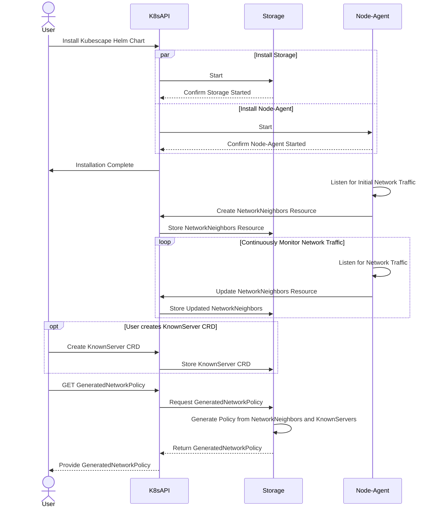

## Advanced Usage  
  
### Known Servers

When generating Network Policies based on captured traffic, we will often encounter IPs which, by themselves, don't have any meaning. They may be part of an bigger network on which every IP actually belongs to the same service, and thus, the entire network should be represented on the policy. Or it may be unclear for someone looking at the policy what this IP actually means, and what service it represents.    
The `KnownServer` CRD comes to take care of both situations. You can define for an IP the network which is equivalent to it, and also the server to which it belongs to. You can also name it in a user-friendly manner, so it will be easier to understand what this IP actually means.

Example of a `KnownServer` CRD:
```yaml
apiVersion: spdx.softwarecomposition.kubescape.io/v1beta1
kind: KnownServer
metadata:
  name: github
spec:
- ipBlock: 142.250.1.100/24
  name: github-workflows
  server: github.com
```

This KnownServer is saying that the IP network of `142.250.1.100/24` is equivalent to the server `github.com`, and on this example we name it `github-workflows`, to give more details about what this service is used for.  
When generating a Network Policy, Kubescape will use this information to enrich the generated Network Policy.    


So if, for example, we encounter the IP `142.250.1.104` in the captured traffic, the generated network policy will have `142.250.1.100/24` as the `ipBlock` for the rule which was generated based on this IP. And the `policyRef` section will include an entry as follows:
```yaml
policyRef:
- server: github.com
  ipBlock: 142.250.1.100/24
  name: github-workflows
  originalIP: 142.250.1.104
  dns: ""
```
The `dns` field will be populated depending on the data retrieved from the node-agent and stored in the `NetworkNeighbors`.
  
You can generate as many `KnownServer` CRDs as you want. Kubescape will use all of them when generating the Network Policy.

### Network Neighbors
The captured traffic is stored by the node-agent in a CRD called `NetworkNeighbors`. This CRD represents the ingress and egress traffic aggregated by the parent workload (for example, if we create a Deployment with 2 Pods, we will only see NetworkNeighbors for the Deployment and not for it Pods nor for it Replicas).  
This CRD is used by the storage to generate the NetworkPolicy on-the-fly upon a request from the user.   

Example of a `NetworkNeighbors` CRD:
```yaml
apiVersion: spdx.softwarecomposition.kubescape.io/v1beta1
kind: NetworkNeighbors
metadata:
  annotations:
    kubescape.io/status: complete
  creationTimestamp: "2023-12-11T17:16:58Z"
  labels:
    kubescape.io/workload-api-group: apps
    kubescape.io/workload-api-version: v1
    kubescape.io/workload-kind: deployment
    kubescape.io/workload-name: operator
    kubescape.io/workload-namespace: kubescape
    kubescape.io/workload-resource-version: "76459062"
  name: deployment-operator
  namespace: kubescape
  resourceVersion: "1"
  uid: e8fb66d7-aad6-40f7-ab14-6267d3c1636d
spec:
  egress:
  - dns: ""
    identifier: ad98a9e00a1e4a5efbbd827f432595a31085d0e8dcec365dbdfd8141bf3cbe3e
    ipAddress: ""
    namespaceSelector: null
    podSelector:
      matchLabels:
        app: otel-collector
    ports:
    - name: TCP-4317
      port: 4317
      protocol: TCP
    type: internal
  - dns: ""
    identifier: e6d07dcea08c02c35494f7aed68e7cff6d51843c5fbb36032a905f11ba833c13
    ipAddress: ""
    namespaceSelector: null
    podSelector:
      matchLabels:
        app: gateway
    ports:
    - name: TCP-8001
      port: 8001
      protocol: TCP
    type: internal
  - dns: ""
    identifier: ed8a3fa8750dd7045e9abb755f5dbd1a2025f5ed49c1ed67b7d8e1c534899bbb
    ipAddress: ""
    namespaceSelector: null
    podSelector:
      matchLabels:
        app: kubescape
    ports:
    - name: TCP-8080
      port: 8080
      protocol: TCP
    type: internal
  - dns: report.armo.cloud.
    identifier: 83260a3ba8236e69f12ebb706196a2d9541b6c2771cb481dde4f3f5816a1cd94
    ipAddress: 16.171.184.118
    namespaceSelector: null
    podSelector: null
    ports:
    - name: TCP-443
      port: 443
      protocol: TCP
    type: external
  - dns: ""
    identifier: e5e8ca3d76f701a19b7478fdc1c8c24ccc6cef9902b52c8c7e015439e2a1ddf3
    ipAddress: ""
    namespaceSelector:
      matchLabels:
        kubernetes.io/metadata.name: kube-system
    podSelector:
      matchLabels:
        k8s-app: kube-dns
    ports:
    - name: UDP-53
      port: 53
      protocol: UDP
    type: internal
  - dns: ""
    identifier: ba56b560f0008cb2227752015bf87c5fc365fb8dfd5599162cbe71f105dfce00
    ipAddress: ""
    namespaceSelector: null
    podSelector:
      matchLabels:
        app: kubevuln
    ports:
    - name: TCP-8080
      port: 8080
      protocol: TCP
    type: internal
  - dns: ""
    identifier: d3e4abc95832bb489fadd3cf2448ad9954e09ef1c6e4aaaf8790097369a873e5
    ipAddress: 10.128.0.90
    namespaceSelector: null
    podSelector: null
    ports:
    - name: TCP-443
      port: 443
      protocol: TCP
    type: internal
  ingress: []
  matchLabels:
    app.kubernetes.io/instance: kubescape
    app.kubernetes.io/name: operator
    tier: ks-control-plane
```  
`spec` - contains the ingress and egress traffic for the workload.  
`egress.identifier` - a unique identifier for an egress traffic entry.  
`egress.ipAddress` - the IP address of the entry's traffic.  
`egress.dns` - the DNS resolution of the entry's traffic, in case its IP address was resolved to a DNS name.  
`egress.namespaceSelector` - the namespace selector for the entry's traffic, in case the traffic is going to a Pod in a different namespace.  
`egress.podSelector` - the pod selector for the entry's traffic, in case the traffic is going to a Pod in the same namespace.  
`egress.ports` - the ports for the entry's traffic.  
`egress.ports.port` - the port number for the entry's traffic.  
`egress.ports.protocol` - the protocol for the entry's traffic.
`egress.ports.name` - the identifier for the port entry.  
`egress.type` - the type of the entry's traffic. Can be `internal` or `external`, where internal means that the traffic is going to a Pod in the cluster, and external means that the traffic is going outside of the cluster.  
`ingress` - same as `egress`, but for ingress traffic.    
To retrieve the `NetworkNeighbors` CRD for a workload, you can run the following command:
```bash
kubectl -n <namespace> get networkneighbors <workload-kind>-<workload-name> -o yaml
```
