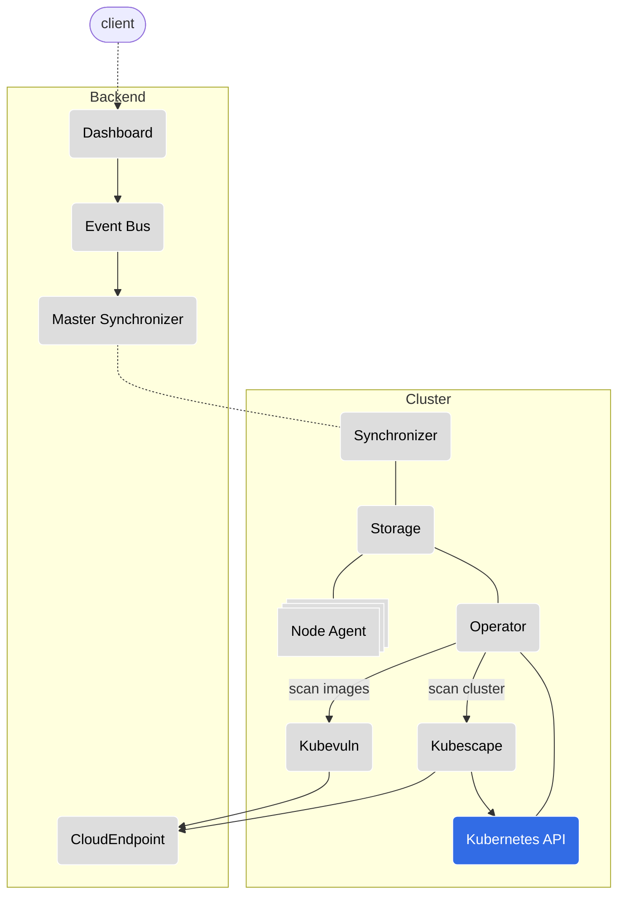
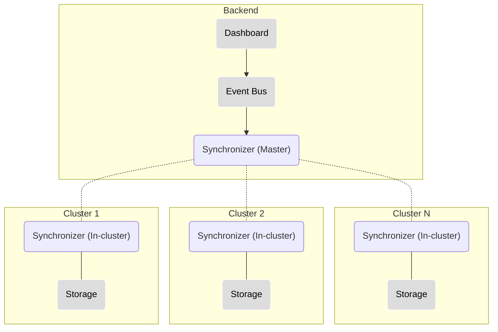
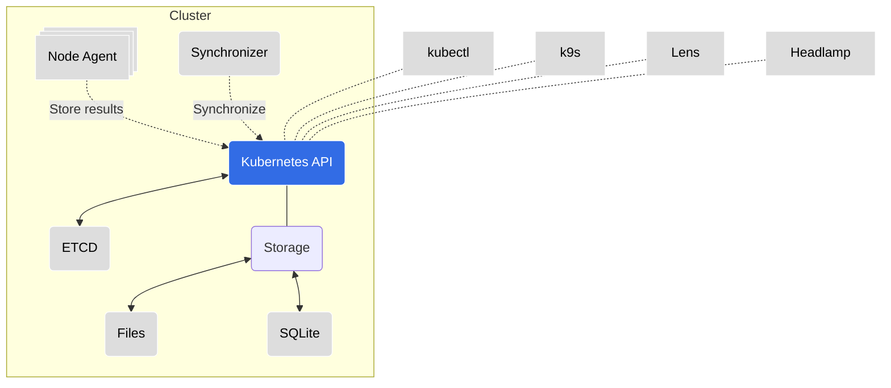
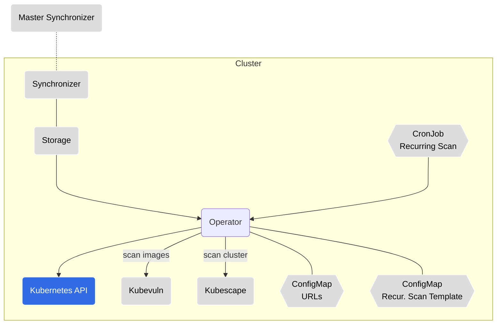
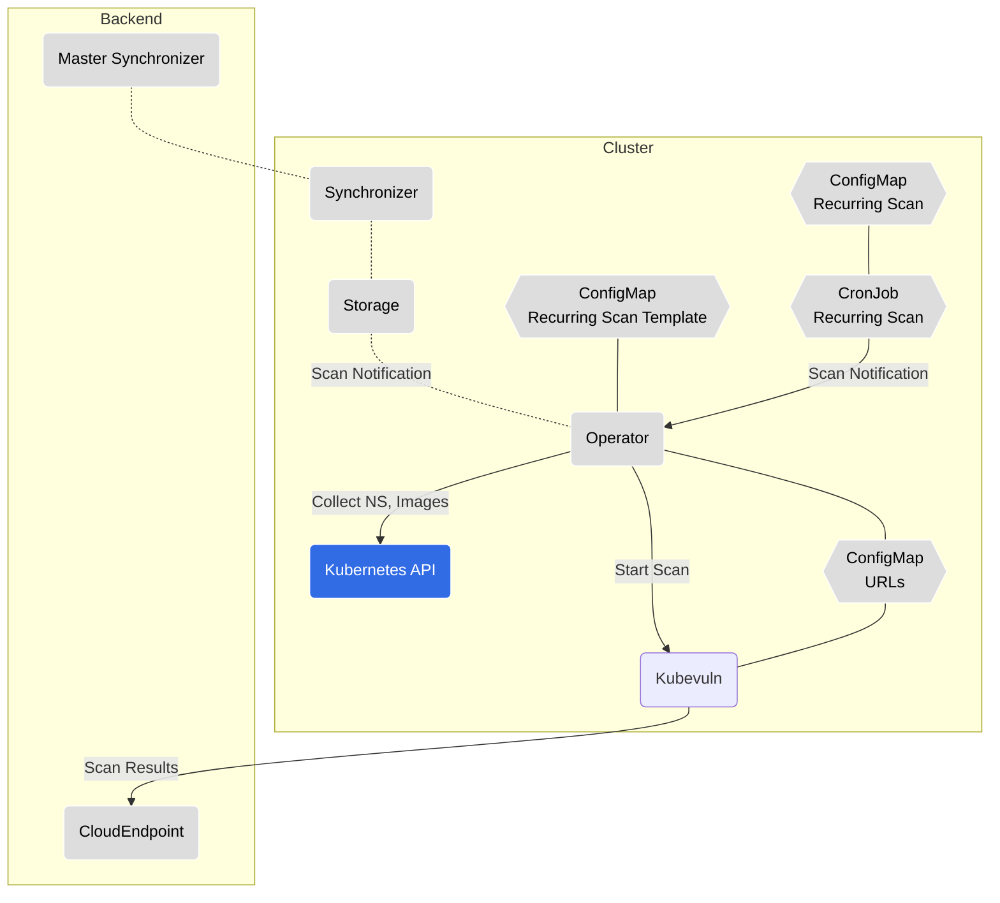
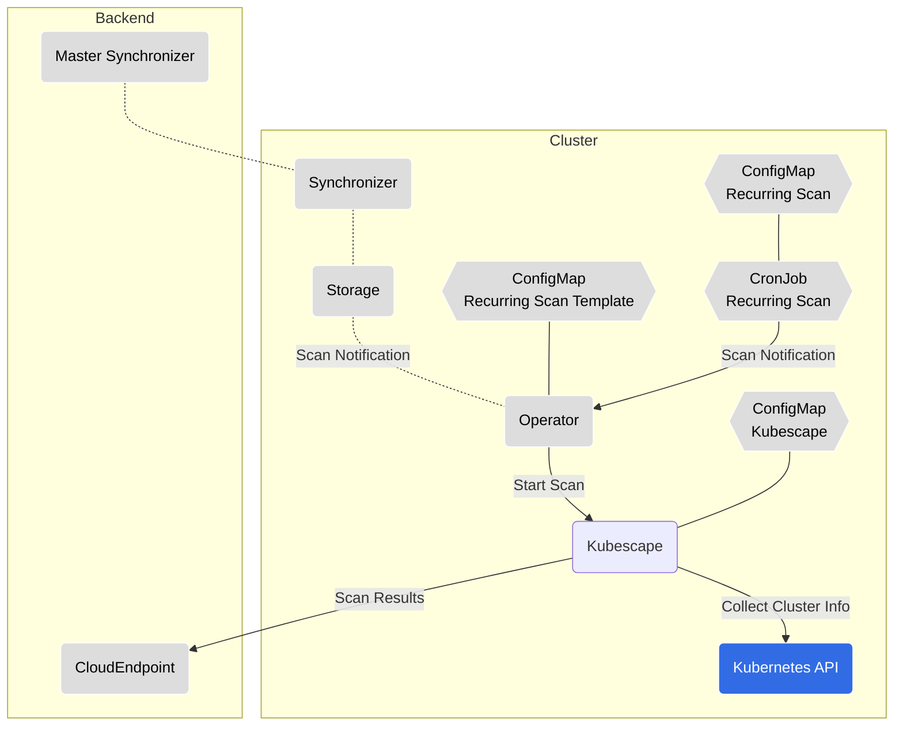
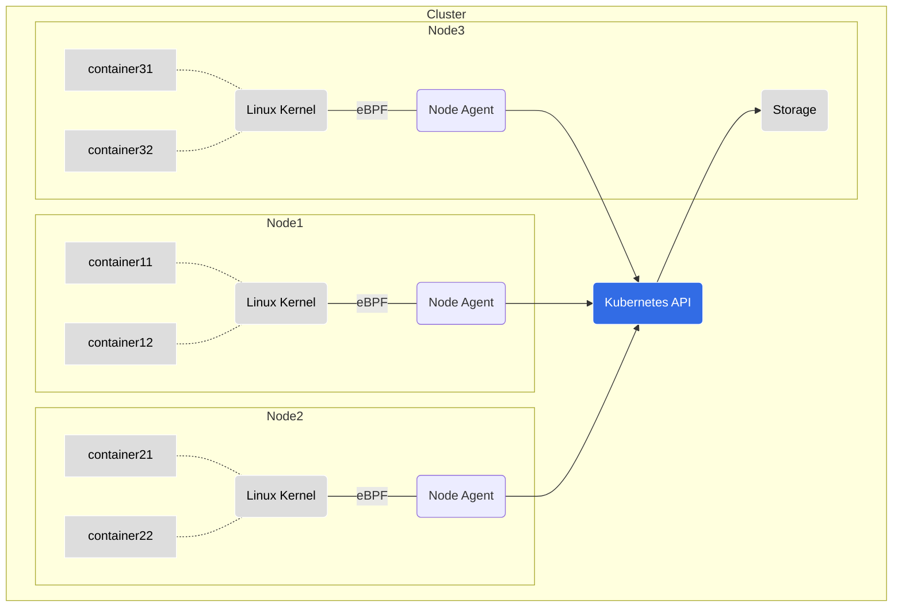

# Kubescape Operator

  

[Kubescape operator documentation](https://kubescape.io/docs/install-operator/)
[Troubleshooting guide](https://hub.armosec.io/docs/installation-troubleshooting#3-the-kubescape-pod-restarted)

## Install

> **Warning:** We only support installing this chart using Helm or ArgoCD.
Using alternative installation methods, such as Kustomize, Helmfile or using custom scripts, may lead to unexpected behavior and issues.
We cannot guarantee compatibility or provide support for deployments that are installed using methods other than Helm or ArgoCD.

Run the install command:

```
helm repo add kubescape https://kubescape.github.io/helm-charts/ ; helm repo update ; helm upgrade --install kubescape kubescape/kubescape-operator -n kubescape --create-namespace --set clusterName=`kubectl config current-context`
```

Verify that the installation was successful:

```shell
$ kubectl get pods -n kubescape
kubescape     kubescape-548d6b4577-qshb5                          1/1     Running   0               60m
kubescape     kubevuln-6779c9d74b-wfgqf                           1/1     Running   0               60m
kubescape     operator-5d745b5b84-ts7zq                           1/1     Running   0               60m
kubescape     storage-59567854fd-hg8n8                            1/1     Running   0               60m
```

## View results

The scanning results will be available gradually as the scans are completed.

View your configuration scan reports:

```
kubectl get workloadconfigurationscans -A
```

View your image vulnerabilities:

```
kubectl get vulnerabilitymanifests -A
```

## Uninstall

You can uninstall this helm chart by running the following command:

```shell
helm uninstall kubescape -n kubescape
```

Then, delete the kubescape namespace:

```shell
kubectl delete ns kubescape
```

### Adjusting Resource Usage for Your Cluster

By default, Kubescape is configured for small- to medium-sized clusters.
If you have a larger cluster and you experience slowdowns or see Kubernetes evicting components, please revise the amount of resources allocated for the troubled component.

Taking Kubescape for example, we found that our defaults of 500 MiB of memory and 500m CPU work well for clusters up to 1250 total resources.
If you have more total resources or experience resource pressure already, first check out how many resources are in your cluster by running the following command:

```
kubectl get all -A --no-headers | wc -l
```

The command should print an approximate count of resources in your cluster.
Then, based on the number you see, allocate 100 MiB of memory for every 200 resources in your cluster over the count of 1250, but no less than 128 MiB total.
The formula for memory is as follows:

```
MemoryLimit := max(128, 0.4 * YOUR_AMOUNT_OF_RESOURCES)
```

For example, if your cluster has 500 resources, a sensible memory limit would be:

```
kubescape:
  resources:
    limits:
      memory: 200Mi  # max(128, 0.4 * 500) == 200
```

If your cluster has 50 resources, we still recommend allocating at least 128 MiB of memory.

Regarding CPU, the more you allocate, the faster Kubescape will scan your cluster.
This is especially true for clusters that have a large amount of resources.
However, we recommend that you give Kubescape no less than 500m CPU no matter the size of your cluster so it can scan a relatively large amount of resources fast ;)

## Chart support

### Values

| Key | Type | Default | Description |
|-----|------|---------|-------------|
| global.networkPolicy.enabled | bool | `false` | Create NetworkPolicies for all components |
| global.networkPolicy.createEgressRules | bool | `false` | Create common Egress rules for NetworkPolicies |
| global.kubescapePsp.enabled | bool | `false` | Enable all privileges in Pod Security Policies for Kubescape namespace |
| global.httpsProxy | string | `""` | Set https egress proxy for all components. Must supply also port.  |
| global.proxySecretFile | string | `""` | Set proxy certificate / RootCA file content (not the file path) for all components to be used for proxy configured in global.httpsProxy |
| global.overrideDefaultCaCertificates.enabled | bool | `false` | Use to enable custom CA Certificates |
| global.overrideDefaultCaCertificates.caCertificates | string | `""` | Set the custom CA Certificates file in all container |
| global.extraCaCertificates.enabled | bool | `false` | Use to enable mapping extra CA Certificate files |
| global.extraCaCertificates.secretName | bool | `""` | Name of the secret that contents will be mapped to `/etc/ssl/certs` in each workload |
| customScheduling.affinity | yaml |  | Use the `affinity` sub-section to define affinity rules that will apply to all of the workloads managed by the kubescape-operator |
| customScheduling.nodeSelector | yaml | | Configure `nodeSelector` rules under the nodeSelector sub-section that will apply to all of the workloads managed by the kubescape-operator |
| customScheduling.tolerations | yaml | | Define `tolerations` in the tolerations sub-section that will apply to all of the workloads managed by the kubescape-operator |
| global.overrideRuntimePath | string | `""` | Override the runtime path for node-agent |
| credentials.cloudSecret | string | `""` | Leave it blank for the default secret. If you have an existing secret, override with the existing secret name to avoid Helm creating a default one |
| kubescape.affinity | object | `{}` | Assign custom [affinity](https://kubernetes.io/docs/concepts/scheduling-eviction/assign-pod-node/) rules to the deployment |
| kubescape.podLabels| object | `{}` | Optional labels to add to the pods |
| kubescape.podAnnotations| object | `{}` | optional map of annotations to be applied to the Pods |
| kubescape.downloadArtifacts | bool | `true` | download policies every scan, we recommend it should remain true, you should change to 'false' when running in an air-gapped environment or when scanning with high frequency (when running with Prometheus) |
| kubescape.enableHostScan | bool | `true` | enable [host scanner feature](https://hub.armosec.io/docs/host-sensor) |
| kubescape.image.repository | string | `"quay.io/kubescape/kubescape"` | [source code](https://github.com/kubescape/kubescape/tree/master/httphandler) (public repo) |
| kubescape.nodeSelector | object | `{}` | [Node selector](https://kubernetes.io/docs/concepts/scheduling-eviction/assign-pod-node/) |
| kubescape.serviceMonitor.enabled | bool | `false` | enable/disable service monitor for prometheus (operator) integration |
| kubescape.skipUpdateCheck | bool | `false` | skip check for a newer version |
| kubescape.labels | `[]` | adds labels to the kubescape microservice |
| kubescape.submit | bool | `true` | submit results to Kubescape SaaS: <https://cloud.armosec.io/> |
| kubescape.volumes | object | `[]` | Additional volumes for Kubescape |
| kubescape.volumeMounts | object | `[]` | Additional volumeMounts for Kubescape |
| kubescapeScheduler.enabled | bool | `true` | enable/disable a kubescape scheduled scan using a CronJob |
| kubescapeScheuler.podLabels| object | `{}` | Optional labels to add to the pods |
| kubescapeScheuler.podAnnotations| object | `{}` | optional map of annotations to be applied to the Pods |
| kubescapeScheduler.image.repository | string | `"quay.io/kubescape/http_request"` | [source code](https://github.com/kubescape/http-request) (public repo) |
| kubescapeScheduler.scanSchedule | string | `"0 0 * * *"` | scan schedule frequency |
| kubescapeScheduler.volumes | object | `[]` | Additional volumes for scan scheduler |
| kubescapeScheduler.volumeMounts | object | `[]` | Additional volumeMounts for scan scheduler |
| kubevuln.affinity | object | `{}` | Assign custom [affinity](https://kubernetes.io/docs/concepts/scheduling-eviction/assign-pod-node/) rules to the deployment |
| kubevuln.podLabels| object | `{}` | Optional labels to add to the pods |
| kubevuln.podAnnotations| object | `{}` | optional map of annotations to be applied to the Pods |
| kubevuln.image.repository | string | `"quay.io/kubescape/kubevuln"` | [source code](https://github.com/kubescape/kubevuln) |
| kubevuln.nodeSelector | object | `{}` | [Node selector](https://kubernetes.io/docs/concepts/scheduling-eviction/assign-pod-node/) |
| kubevuln.volumes | object | `[]` | Additional volumes for the image vulnerability scanning |
| kubevuln.volumeMounts | object | `[]` | Additional volumeMounts for the image vulnerability scanning |
| kubevuln.config.grypeDbListingURL | string | `""` | Parameter to override the default Grype vulnerability database URL (listings.json format) |
| kubevulnScheduler.enabled | bool | `true` | enable/disable an image vulnerability scheduled scan using a CronJob |
| kubevulnScheduler.podLabels| object | `{}` | Optional labels to add to the pods |
| kubevulnScheduler.podAnnotations| object | `{}` | optional map of annotations to be applied to the Pods |
| kubevulnScheduler.image.repository | string | `"quay.io/kubescape/http_request"` | [source code](https://github.com/kubescape/http-request) (public repo) |
| kubevulnScheduler.scanSchedule | string | `"0 0 * * *"` | scan schedule frequency |
| kubevulnScheduler.volumes | object | `[]` | Additional volumes for scan scheduler |
| kubevulnScheduler.volumeMounts | object | `[]` | Additional volumeMounts for scan scheduler |
| operator.affinity | object | `{}` | Assign custom [affinity](https://kubernetes.io/docs/concepts/scheduling-eviction/assign-pod-node/) rules to the deployment |
| operator.podLabels| object | `{}` | Optional labels to add to the pods |
| operator.podAnnotations| object | `{}` | optional map of annotations to be applied to the Pods |
| operator.image.repository | string | `"quay.io/kubescape/operator"` | [source code](https://github.com/kubescape/operator) |
| operator.nodeSelector | object | `{}` | [Node selector](https://kubernetes.io/docs/concepts/scheduling-eviction/assign-pod-node/) |
| operator.volumes | object | `[]` | Additional volumes for the web socket |
| operator.volumeMounts | object | `[]` | Additional volumeMounts for the web socket |
| hostScanner.volumes | object | `[]` | Additional volumes for the host scanner |
| hostScanner.volumeMounts | object | `[]` | Additional volumeMounts for the host scanner |
| awsIamRoleArn | string | `nil` | AWS IAM arn role |
| cloudProviderMetadata.secretRef.name | string | `nil` | secret name to define values for the provider's metadata |
| cloudProviderMetadata.cloudRegion | string or through `cloudProviderMetadata.secretRef.cloudRegionKey` if `cloudProviderMetadata.secretRef.name` is set | `nil` | cloud region |
| cloudProviderMetadata.gkeProject | string or through `cloudProviderMetadata.secretRef.gkeProjectKey` if `cloudProviderMetadata.secretRef.name` is set | `nil` | GKE project |
| cloudProviderMetadata.gkeServiceAccount | string | `nil` | GKE service account |
| cloudProviderMetadata.aksSubscriptionID | string or through `cloudProviderMetadata.secretRef.subscriptionIdKey` if `cloudProviderMetadata.secretRef.name` is set | `nil` | AKS subscription ID |
| cloudProviderMetadata.aksResourceGroup | string or through `cloudProviderMetadata.secretRef.resourceGroupKey` if `cloudProviderMetadata.secretRef.name` is set | `nil` | AKS resource group |
| cloudProviderMetadata.aksClientID | string or through `cloudProviderMetadata.secretRef.clientIdKey` if `cloudProviderMetadata.secretRef.name` is set | `nil` | AKS client ID |
| cloudProviderMetadata.aksClientSecret | string or through `cloudProviderMetadata.secretRef.clientSecretKey` if `cloudProviderMetadata.secretRef.name` is set | `nil` | AKS client secret |
| cloudProviderMetadata.aksTenantID | string or through `cloudProviderMetadata.secretRef.tenantIdKey` if `cloudProviderMetadata.secretRef.name` is set | `nil` | AKS tenant ID |
| volumes | object | `[]` | Additional volumes for all containers |
| volumeMounts | object | `[]` | Additional volumeMounts for all containers |
| imageScanning.privateRegistries.credentials | object | `[]` | Credentials for scanning images pulled from private container registries. This configuration is not needed when using `imagePullSecrets`|
| imageScanning.privateRegistries.credentials.registry | string | `nil` | URL of the private container registry.|
| imageScanning.privateRegistries.credentials.username | string | `nil` | Username/Client ID for authentication.|
| imageScanning.privateRegistries.credentials.password | string | `nil` | Password/Token/Client Secret for authentication.|
| imageScanning.privateRegistries.credentials.skipTlsVerify | bool | `false` | Skip TLS certificate verification |
| imageScanning.privateRegistries.credentials.insecure | bool | `false` | Use HTTP instead of HTTPS |
| configurations.priorityClass.enabled | bool | `true` | Add priority class to the installed components |
| configurations.priorityClass.daemonset | int | 100000100 | PriorityClass of the DaemonSet, this should be higher than the other components so the DaemonSet will schedule on all nodes |

# In-cluster components overview

An overview of each in-cluster component which is part of the Kubescape platform helm chart.
Follow the repository link for in-depth information on a specific component.

---

## High-level Architecture Diagram



---

## [Synchronizer](https://github.com/kubescape/synchronizer)

* **Resource Kind:** `Deployment`
* **Communication:** gRPC, REST API, Websocket
* **Responsibility:** This component is an optional part of the Kubescape Operator. It enables users to replicate the Kubernetes objects in the cluster (somewhat like `rsync`) to a remote service. It is used for collecting the Kubescape Operator objects by central services monitoring multiple clusters.

In our architecture, the Synchronizer acts both as a server and a client, depending on its running configuration:

* Master Synchronizer: Refers to the instance running in the backend.
* In-cluster Synchronizer: Refers to the instance running in the cluster.
  Registered to the Master Synchronizer using a websocket; Synchronizes Kubernetes objects and virtual objects,
  this enables executing actions in runtime.

A Master Synchronizer communicates with multiple in-cluster Synchronizers.



---

## [Storage](https://github.com/kubescape/storage)

* **Resource Kind:** `Deployment` (singleton)
* **Communication:** gRPC, REST API
* **Responsibility:** This component is a Kubernetes [aggregated API extension](https://kubernetes.io/docs/concepts/extend-kubernetes/api-extension/apiserver-aggregation/) service. It stores the different objects produced by the other components and stores them on a volume as files and SQLite. It is a singleton component in the current implementation and cannot be scaled horizontaly, but it is running in 10k node clusters.



---

## [Operator](https://github.com/kubescape/operator)

* **Resource Kind:** `Deployment`
* **Communication:** gRPC, REST API
* **Responsibility:** This component is in charge of command and control of the scans in the cluster. There are multiple configuration options when and what to scan in the cluster. This component is in charge of orchestrating these activities by triggering the *Kubescape* and the *KubeVuln* components.



---

## [Kubevuln](https://github.com/kubescape/kubevuln/)

* **Resource Kind:** `Deployment`
* **Communication:** gRPC, REST API
* **Responsibility:** This component is in charge of the image vulnerability scanning. It can either produce SBOM object in the *Storage* and match the SBOM entries with vulnerabilities, or relies on the *Node agent* to generate SBOM objects on the nodes and then produce vulnerability manfiests and VEX. All the results are stored in the *Storage* component via the Kubernetes API and optionally sent to external API endpoints.



---

## [Kubescape](https://github.com/kubescape/kubescape/tree/master/httphandler)

* **Resource Kind:** `Deployment`
* **Communication:** gRPC, REST API
* **Responsibility:** This component is in charge of configuration and host scanning. It is, like the CLI, uses [OPA engine](https://github.com/open-policy-agent/opa) to run the project's own Rego library of rules. It also scans the Kubernetes host to validate their configurations. The output of the scans are stored in the *Storage* component via the Kubernetes API and optionally sent to external API endpoints.



---

## [Node Agent](https://github.com/kubescape/node-agent)

* **Resource Kind:** `Daemonset`
* **Communication:** gRPC, REST API
* **Responsibility:** This component has multiple purposes all bound to information available on Kubernetes nodes:
  * Produces SBOMs from the images avialable on the node (used by *KubeVuln*)
  * Produces information from the configurations of the Linux host of the Kubernetes node (used by *Kubescape*)
  * Creates *ApplicationProfile* using [Inspektor Gadget](https://inspektor-gadget.io) and eBPF. These profiles log the behavior of each container on the node (file access, processes launched, capabilities used, system calls done) into *ApplicationProfile* objects stored in the *Storage* component via the Kubernetes API and optionally sent to external API endpoints.
  * Creates *NetworkNeighborhood* objects using [Inspektor Gadget](https://inspektor-gadget.io) and eBPF. These profiles log the network activity of each container and they stored as objects in the *Storage* component via the Kubernetes API and optionally sent to external API endpoints.
  * Monitors container activity via eBPF and evaluates them using its own rule engine that combines static detection rules and anomaly detection to produce alerts that can be exported to AlertManager, Syslog, HTTP endpoints, STDOUT stream and other.



---

## Kubernetes API

Some in-cluster components communicate with the Kubernetes API server for different purposes:

* Operator

  Creates/updates/deletes resources for recurring scan purposes (CronJobs, ConfigMaps). Collects required information (NS, image names/tags) for Kubevuln's image scanning.

* Kubescape

  Collects namespaces, workloads, RBAC etc. required for cluster scans.

---

## Backend components

The backend components are running in [Kubescape's SaaS offering](https://cloud.armosec.io/).

### Dashboard

* REST API service

### CloudEndpoint

* **Responsibility:** Receive and process Kubescape & Kubevuln scan results.
* **Communication:** REST API

---

## Logging and troubleshooting

Each component writes logs to the standard output.

Every action has a generated `jobId` which is written to the log.

An action which creates sub-action(s), will be created with a different `jobId` but with a `parentId` which will correlate to the parent action's `jobId`.

### Distroless images

Each component is built as a distroless image. This means that the image does not contain any shell or package manager. This is done for security reasons.

In order to troubleshoot a component, you can use the `kubectl debug` command to add an [ephemeral container](https://kubernetes.io/docs/tasks/debug/debug-application/debug-running-pod/#ephemeral-container) to the pod and run a shell in it:

```bash
kubectl -n kubescape debug -it <pod-name> --image=docker.io/busybox --target=<container-name>
```

**Note:** The `--target` parameter must be supported by the Container Runtime.
When not supported, the Ephemeral Container may not be started, or it may be started with an isolated process namespace so that `ps` does not reveal processes in other containers.

Use `kubectl delete` to remove the Pod when you're finished (there is no other way to remove the ephemeral container):

```bash
kubectl -n kubescape delete pod <pod-name>
```

---

## Recurring scans

3 types of recurring scans are supported:

  1. Cluster configuration scanning (Kubescape)
  2. Vulnerability scanning for container images (Kubevuln)
  3. Container registry scanning (Kubevuln)

When creating a recurring scan, the Operator component will create a `ConfigMap` and a `CronJob` from a recurring template ConfigMap. Each scan type comes with a template.

The CronJob itself does not run the scan directly. When a CronJob is ready to run, it will send a REST API request to the Operator component, which will then trigger the relevant scan.

The scan results are then sent by each relevant component to the CloudEndpoint.

---

## Common Issues

* Error starting the container watcher - `(fanotify)`.

  This error is usually caused by the `node-agent` not being able to find `runc` in any of the default paths.
  This can be fixed by adding the path of `runc` to the global configuration [here](#values).
  If you aren't sure where `runc` is located, you can run the following command on the node to find it:

  ```bash
  find / -name runc 2>/dev/null
  ```

  In case you are in an environment where you can't access the node, one solution is to run a privileged pod on the node, and run the command from there. To create a privileged pod, run the following command:

  ```bash
   kubectl run --rm -i --tty busybox --image=busybox --restart=Never --overrides='{"spec": {"template": {"spec": {"containers": [{"securityContext": {"privileged": true} }]}}}}' -- /bin/sh
  ```

  For K3s, the `runc` binary is different from the system one, and is located in `/var/lib/rancher/k3s/data/current/bin/runc`. Given this path, the option to set during the Helm installation is (note the `/host` prefix):

  ```bash
  --set global.overrideRuntimePath="/host/var/lib/rancher/k3s/data/current/bin/runc"
  ```
