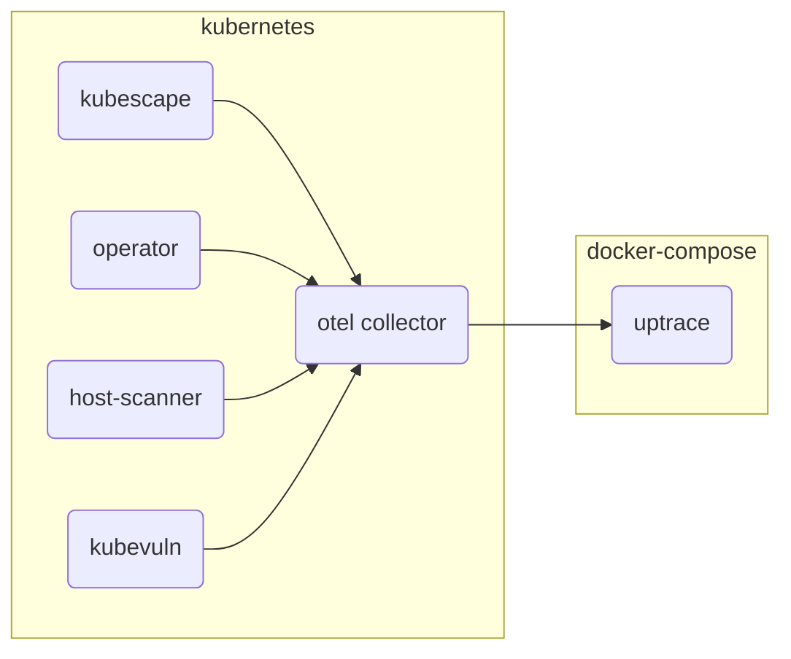
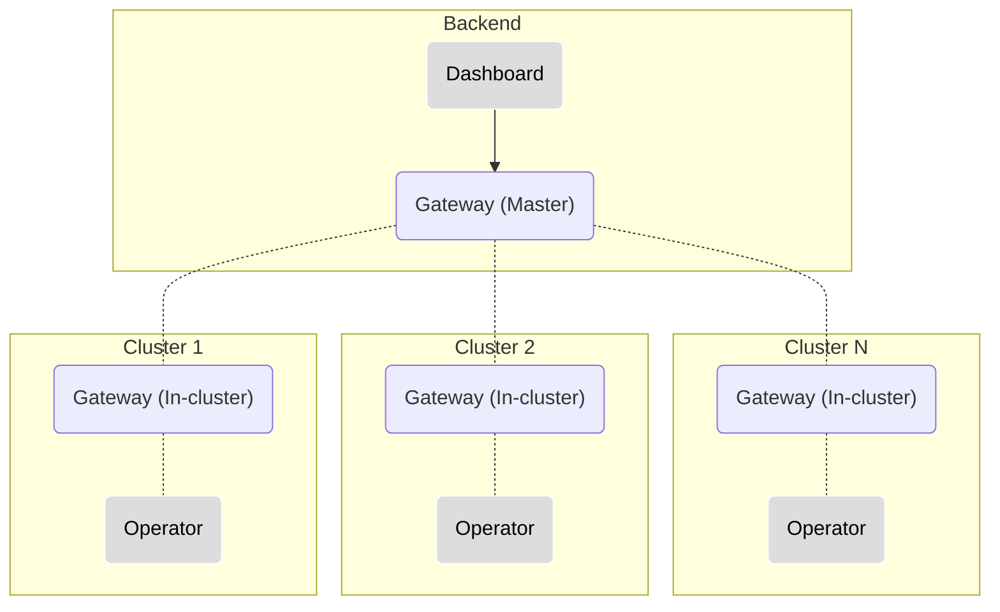
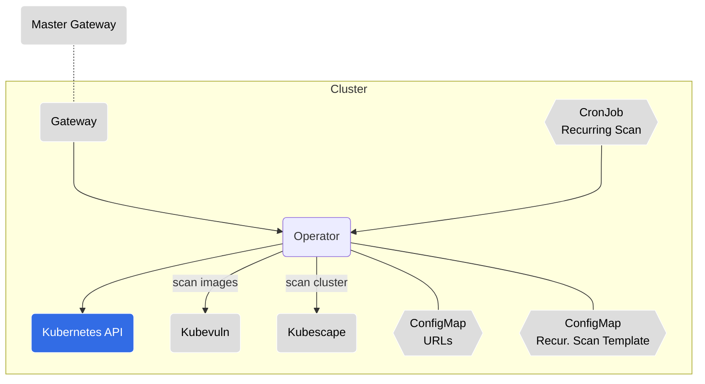
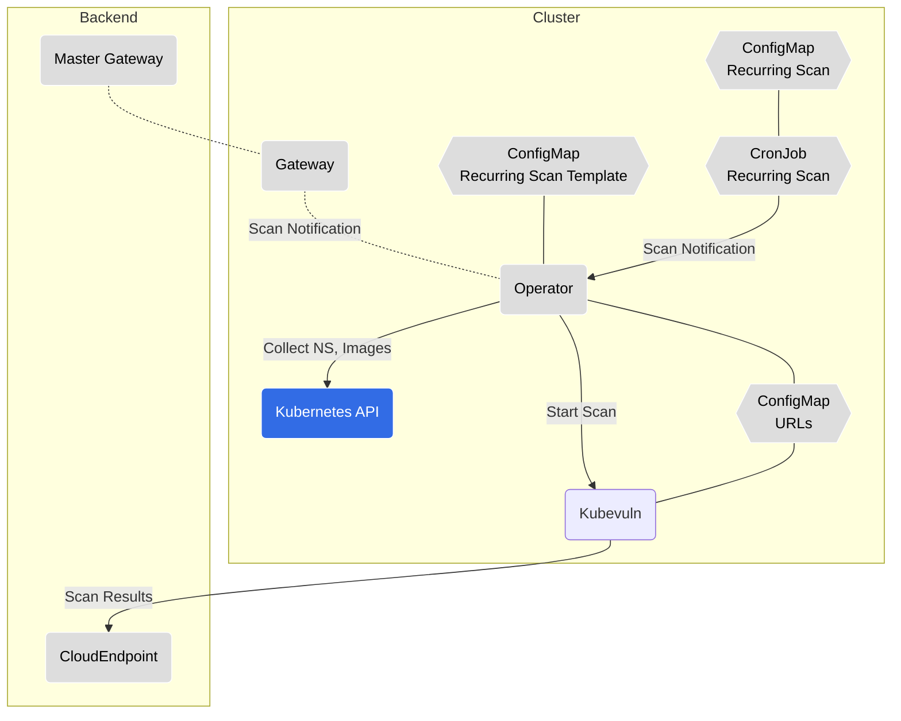
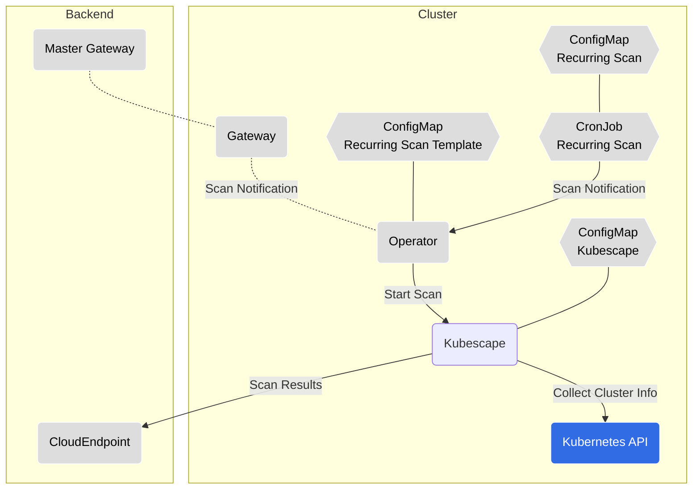
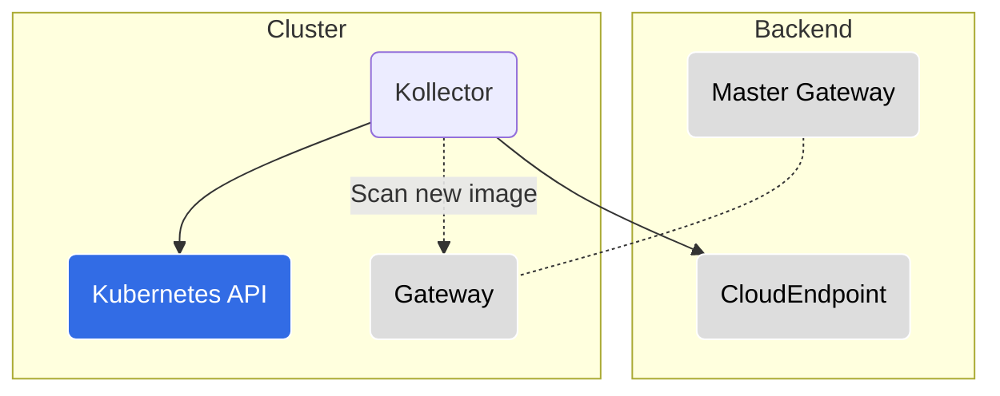
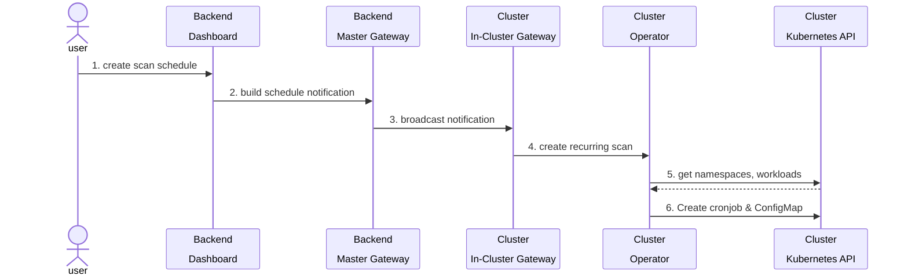
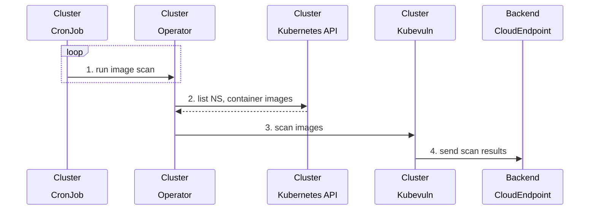
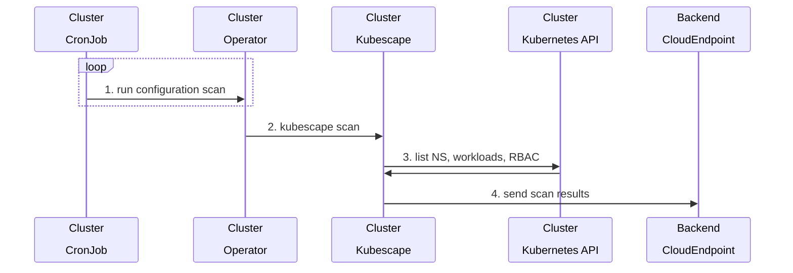

# Kubescape Operator

  

## [Docs](https://hub.armosec.io/docs/installation-of-armo-in-cluster)

## Installing Kubescape Operator in a Kubernetes cluster using Helm:

1. Add the Kubescape Helm Repo
```
helm repo add kubescape https://kubescape.github.io/helm-charts/
```

2. Update helm repo
```
helm repo update
```

3. Install the Helm Chart, use your account ID and give your cluster a name 

if you ran kubescape cli tool and submitted, you can get your Account ID from the local cache: 
```
kubescape config view | grep -i accountID
```
Otherwise, get the account ID from the [kubescape SaaS](https://hub.armosec.io/docs/installation-of-armo-in-cluster#install-a-pre-registered-cluster)

Run the install command:
```
helm upgrade --install kubescape kubescape/kubescape-operator -n kubescape --create-namespace --set account=<my_account_ID> --set clusterName=`kubectl config current-context` 
```

> Add `--set clientID=<generated client id> --set secretKey=<generated secret key>` if you have [generated an auth key](https://hub.armosec.io/docs/authentication)

> Add `--set kubescape.serviceMonitor.enabled=true` for installing the Prometheus service monitor, [read more about Prometheus integration](https://hub.armosec.io/docs/prometheus-exporter)

### Removing old version of Kubescape helm chart
To avoid collisions, if are running an older versions (>=`1.7.18`), you should run the following command: `helm uninstall armo -n armo-system`

### Adjusting Resource Usage for Your Cluster

By default, Kubescape is configured for small- to medium-sized clusters.
If you have a larger cluster and you experience slowdowns or see Kubernetes evicting components, please revise the amount of resources allocated for the troubled component.

Taking Kubescape for example, we found that our defaults of 500 MiB of memory and 500m CPU work well for clusters up to 1250 total resources.
If you have more total resources or experience resource pressure already, first check out how many resources are in your cluster by running the following command:

```
kubectl get all -A --no-headers | wc -l
```

The command should print an approximate count of resources in your cluster.
Then, based on the number you see, allocate 100 MiB of memory for every 200 resources in your cluster over the count of 1250, but no less than 128 MiB total.
The formula for memory is as follows:
```
MemoryLimit := max(128, 0.4 * YOUR_AMOUNT_OF_RESOURCES)
```

For example, if your cluster has 500 resources, a sensible memory limit would be:
```
kubescape:
  resources:
    limits:
      memory: 200Mi  # max(128, 0.4 * 500) == 200
```
If your cluster has 50 resources, we still recommend allocating at least 128 MiB of memory.

When it comes to CPU, the more you allocate, the faster Kubescape will scan your cluster.
This is especially true for clusters that have a large amount of resources.
However, we recommend that you give Kubescape no less than 500m CPU no matter the size of your cluster so it can scan a relatively large amount of resources fast ;)

### Setting up Telemetry
Several or our in-cluster components implement telemetry data using [OpenTelemetry](https://opentelemetry.io/) (otel).
You can optionally install an otel [collector](https://opentelemetry.io/docs/collector/) to your cluster to aggregate all metrics and send them to your own tracing tool.

You simply have to fill in these information before [installing kubescape operator](#installing-kubescape-operator-in-a-kubernetes-cluster-using-helm):
```
otelCollector:
  enabled: true
  endpoint:
    host: <ip or dns for your gRPC otel endpoint>
    port: 4317
    insecure: <whether your otel endpoint requires ssl>
    headers: <optional - map of headers required by tracing tool>
```

If you don't have an otel distribution, we suggest you try either [Uptrace](https://github.com/uptrace/uptrace/tree/master/example/docker) or [SigNoz](https://signoz.io/docs/install/docker/)
as they are free, opensource and can be quickly deployed using docker-compose.

#### Host metrics collection

The OpenTelemetry collector is configured with the [`hostmetrics`](https://github.com/open-telemetry/opentelemetry-collector-contrib/blob/main/receiver/hostmetricsreceiver/README.md) receiver to collect CPU and memory utilization metrics.

Note that the hostmetrics receiver is disabled by default. If you wish to enable it, simply install the operator with `--set otelCollector.hostmetrics.enabled=true`

#### Example: exporting to uptrace running inside docker-compose



1. Download the example using Git:

```shell
git clone https://github.com/uptrace/uptrace.git
cd uptrace/example/docker
```

2. Start the services using Docker:

```shell
docker-compose pull
docker-compose up -d
```

3. Make sure Uptrace is running:

```shell
docker-compose logs uptrace
```

4. Follow the [instructions above](#installing-kubescape-operator-in-a-kubernetes-cluster-using-helm), add the OTEL collector configuration and install the operator as follows:
  
  ```
  --set otelCollector.enabled=true --set otelCollector.endpoint.host=<collector host> --set otelCollector.endpoint.port=14317 --set otelCollector.endpoint.insecure=false
  ```

5. Open Uptrace UI at [http://localhost:14318/overview/2](http://localhost:14318/overview/2)


## Chart support

### Values

| Key | Type | Default | Description |
|-----|------|---------|-------------|
| global.networkPolicy.enabled | bool | `false` | Create NetworkPolicies for all components |
| global.networkPolicy.createEgressRules | bool | `false` | Create common Egress rules for NetworkPolicies |
| global.kubescapePsp.enabled | bool | `false` | Enable all privileges in Pod Security Policies for Kubescape namespace |
| global.httpsProxy | string | `""` | Set https egress proxy for all components. Must supply also port.  |
| global.proxySecretFile | string | `""` | Set proxy certificate / RootCA for all components to be used for proxy configured in global.httpsProxy |
| kollector.affinity | object | `{}` | Assign custom [affinity](https://kubernetes.io/docs/concepts/scheduling-eviction/assign-pod-node/) rules to the StatefulSet |
| kollector.enabled | bool | `true` | enable/disable the kollector |
| kollector.env[0] | object | `{"name":"PRINT_REPORT","value":"false"}` | print in verbose mode (print all reported data) |
| kollector.image.repository | string | `"quay.io/kubescape/kollector"` | [source code](https://github.com/kubescape/kollector) |
| kollector.nodeSelector | object | `{}` | [Node selector](https://kubernetes.io/docs/concepts/scheduling-eviction/assign-pod-node/) |
| kollector.volumes | object | `[]` | Additional volumes for the collector |
| kollector.volumeMounts | object | `[]` | Additional volumeMounts for the collector |
| kubescape.affinity | object | `{}` | Assign custom [affinity](https://kubernetes.io/docs/concepts/scheduling-eviction/assign-pod-node/) rules to the deployment |
| kubescape.downloadArtifacts | bool | `true` | download policies every scan, we recommend it should remain true, you should change to 'false' when running in an air-gapped environment or when scanning with high frequency (when running with Prometheus) |
| kubescape.enableHostScan | bool | `true` | enable [host scanner feature](https://hub.armosec.io/docs/host-sensor) |
| kubescape.enabled | bool | `true` | enable/disable kubescape scanning |
| kubescape.image.repository | string | `"quay.io/kubescape/kubescape"` | [source code](https://github.com/kubescape/kubescape/tree/master/httphandler) (public repo) |
| kubescape.nodeSelector | object | `{}` | [Node selector](https://kubernetes.io/docs/concepts/scheduling-eviction/assign-pod-node/) |
| kubescape.serviceMonitor.enabled | bool | `false` | enable/disable service monitor for prometheus (operator) integration |
| kubescape.skipUpdateCheck | bool | `false` | skip check for a newer version |
| kubescape.submit | bool | `true` | submit results to Kubescape SaaS: https://cloud.armosec.io/ |
| kubescape.volumes | object | `[]` | Additional volumes for Kubescape |
| kubescape.volumeMounts | object | `[]` | Additional volumeMounts for Kubescape |
| kubescapeScheduler.enabled | bool | `true` | enable/disable a kubescape scheduled scan using a CronJob |
| kubescapeScheduler.image.repository | string | `"quay.io/kubescape/http_request"` | [source code](https://github.com/kubescape/http-request) (public repo) |
| kubescapeScheduler.scanSchedule | string | `"0 0 * * *"` | scan schedule frequency |
| kubescapeScheduler.volumes | object | `[]` | Additional volumes for scan scheduler |
| kubescapeScheduler.volumeMounts | object | `[]` | Additional volumeMounts for scan scheduler |
| gateway.affinity | object | `{}` | Assign custom [affinity](https://kubernetes.io/docs/concepts/scheduling-eviction/assign-pod-node/) rules to the deployment |
| gateway.enabled | bool | `true` | enable/disable passing notifications from Kubescape SaaS to the Operator microservice. The notifications are the onDemand scanning and the scanning schedule settings |
| gateway.image.repository | string | `"quay.io/kubescape/gateway"` | [source code](https://github.com/kubescape/gateway) |
| gateway.nodeSelector | object | `{}` | [Node selector](https://kubernetes.io/docs/concepts/scheduling-eviction/assign-pod-node/) |
| gateway.volumes | object | `[]` | Additional volumes for the notification service |
| gateway.volumeMounts | object | `[]` | Additional volumeMounts for the notification service |
| kubevuln.affinity | object | `{}` | Assign custom [affinity](https://kubernetes.io/docs/concepts/scheduling-eviction/assign-pod-node/) rules to the deployment |
| kubevuln.enabled | bool | `true` | enable/disable image vulnerability scanning |
| kubevuln.image.repository | string | `"quay.io/kubescape/kubevuln"` | [source code](https://github.com/kubescape/kubevuln) |
| kubevuln.nodeSelector | object | `{}` | [Node selector](https://kubernetes.io/docs/concepts/scheduling-eviction/assign-pod-node/) |
| kubevuln.volumes | object | `[]` | Additional volumes for the image vulnerability scanning |
| kubevuln.volumeMounts | object | `[]` | Additional volumeMounts for the image vulnerability scanning |
| kubevulnScheduler.enabled | bool | `true` | enable/disable a image vulnerability scheduled scan using a CronJob |
| kubevulnScheduler.image.repository | string | `"quay.io/kubescape/http_request"` | [source code](https://github.com/kubescape/http-request) (public repo) |
| kubevulnScheduler.scanSchedule | string | `"0 0 * * *"` | scan schedule frequency |
| kubevulnScheduler.volumes | object | `[]` | Additional volumes for scan scheduler |
| kubevulnScheduler.volumeMounts | object | `[]` | Additional volumeMounts for scan scheduler |
| operator.affinity | object | `{}` | Assign custom [affinity](https://kubernetes.io/docs/concepts/scheduling-eviction/assign-pod-node/) rules to the deployment |
| operator.enabled | bool | `true` | enable/disable kubescape and image vulnerability scanning |
| operator.image.repository | string | `"quay.io/kubescape/operator"` | [source code](https://github.com/kubescape/operator) |
| operator.nodeSelector | object | `{}` | [Node selector](https://kubernetes.io/docs/concepts/scheduling-eviction/assign-pod-node/) |
| operator.volumes | object | `[]` | Additional volumes for the web socket |
| operator.volumeMounts | object | `[]` | Additional volumeMounts for the web socket |
| hostScanner.volumes | object | `[]` | Additional volumes for the host scanner |
| hostScanner.volumeMounts | object | `[]` | Additional volumeMounts for the host scanner |
| awsIamRoleArn | string | `nil` | AWS IAM arn role |
| addRevisionLabel | bool | `true` | Add revision label to the components. This will insure the components will restart when updating the helm |
| cloudProviderMetadata.cloudRegion | string | `nil` | cloud region |
| cloudProviderMetadata.gkeProject | string | `nil` | GKE project |
| cloudProviderMetadata.gkeServiceAccount | string | `nil` | GKE service account |
| cloudProviderMetadata.aksSubscriptionID | string | `nil` | AKS subscription ID |
| cloudProviderMetadata.aksResourceGroup | string | `nil` | AKS resource group |
| triggerNewImageScan | bool | `false` | enable/disable trigger image scan for new images |
| volumes | object | `[]` | Additional volumes for all containers |
| volumeMounts | object | `[]` | Additional volumeMounts for all containers |


# In-cluster components overview

An overview of each in-cluster component which is part of the Kubescape platform helm chart.
Follow the repository link for in-depth information on a specific component.

---

## High-level Architecture Diagram


---

## [Gateway](https://github.com/kubescape/gateway)

* __Resource Kind:__ `Deployment`
* __Communication:__ REST API, Websocket
* __Responsibility:__ Broadcasts a message received to its registered clients. When a client registers itself in a Gateway it must provide a set of attributes, which will serve as identification, for message routing purposes.

  In our architecture, the Gateway acts both as a server and a client, depending on its running configuration:
  * Master Gateway: Refers to the instance running in the backend. Broadcasts messages to all of its registered Gateways.
  * In-cluster Gateway: Refers to the instance running in the cluster. Registered to the Master Gateway using a websocket; Broadcasts messages to the different in-cluster components, this enables executing actions in runtime.

  A Master Gateway communicates with multiple in-cluster Gateways, hence it is able to communicate with multiple clusters.



---

## [Operator](https://github.com/kubescape/operator)

* __Resource Kind:__ `Deployment`
* __Communication:__ REST API, Websocket
* __Responsibility:__ The Operator component is at the heart of the solution as it is the triggering engine for the different actions in the cluster; It responds to REST API requests and messages received over websocket connection, and triggers the relevant action in the cluster. Such actions could be triggering a configuration scan, image vulnerability scan, defining a recurring scan (by creating CronJobs), etc.



---

## [Kubevuln](https://github.com/kubescape/kubevuln/)

* __Resource Kind:__ `Deployment`
* __Communication:__ REST API
* __Responsibility:__ Scans container images for vulnerabilities, using [Grype](https://github.com/anchore/grype) as its engine.



---

## [Kubescape](https://github.com/kubescape/kubescape/tree/master/httphandler)

* __Resource Kind:__ `Deployment`
* __Communication:__ REST API
* __Responsibility:__ Runs [Kubescape](https://github.com/kubescape/kubescape) for detecting misconfigurations in the cluster; This is microservice uses the same engine as the Kubescape CLI tool.



---

## [Kollector](https://github.com/kubescape/kollector)

* __Resource Kind:__ `StatefulSet`
* __Responsibility:__ Communicates with the Kubernetes API server to collect cluster information and watches for changes in the cluster. Information is reported to the backend via the CloudEndpoint and the Gateway.



---

## [URLs ConfigMap](https://github.com/kubescape/helm-charts/blob/master/charts/kubescape-operator/templates/cloudapi-configmap.yaml)

Holds a list of communication URLs. Used by the following components:

* Operator
* Kubevuln
* Gateway

<details><summary>Config Example (YAML)</summary>

```yaml
gatewayWebsocketURL: 127.0.0.1:8001                             # component: in-cluster gateway
gatewayRestURL: 127.0.0.1:8002                                  # component: in-cluster gateway
kubevulnURL: 127.0.0.1:8081                                     # component: kubevuln
kubescapeURL: 127.0.0.1:8080                                    # component: kubescape
EventReceiverRestURL: https://report.cloud.com                  # component: ARMO CloudEndpoint
EventReceiverWebsocketURL: wss://report.cloud.com               # component: ARMO CloudEndpoint
rootGatewayURL: wss://masterns.cloud.com/v1/waitfornotification # component: master gateway
accountID: 1111-aaaaa-4444-555
clusterName: minikube
```
</details>

---

## Kubernetes API

Some in-cluster components communicate with the Kubernetes API server for different purposes:

* Kollector

  Watches for changes in namespace, workloads, nodes. Reports information to the CloudEndpoint. Identifies image-related changes and triggers an image scanning on the new images accordingly (scanning new images functionality is optional).

* Operator

  Creates/updates/deletes resources for recurring scan purposes (CronJobs, ConfigMaps). Collects required information (NS, image names/tags) for Kubevuln's image scanning.

* Kubescape

  Collects namespaces, workloads, RBAC etc. required for cluster scans.

---

## Backend components

The backend components are running in [Kubescape's SaaS offering](https://cloud.armosec.io/).

### Dashboard

* REST API service

### CloudEndpoint

* __Responsibility:__ Receive and process Kubescape & Kubevuln scan results.
* __Communication:__ REST API

---

## Logging and troubleshooting

Each component writes logs to the standard output.

Every action has a generated `jobId` which is written to the log.

An action which creates sub-action(s), will be created with a different `jobId` but with a `parentId` which will correlate to the parent action's `jobId`.

### Distroless images

Each component is built as a distroless image. This means that the image does not contain any shell or package manager. This is done for security reasons.

In order to troubleshoot a component, you can use the `kubectl debug` command to add an [ephemeral container](https://kubernetes.io/docs/tasks/debug/debug-application/debug-running-pod/#ephemeral-container) to the pod and run a shell in it:

```bash
kubectl -n kubescape debug -it <pod-name> --image=busybox --target=<container-name>
```

**Note:** The `--target` parameter must be supported by the Container Runtime.
When not supported, the Ephemeral Container may not be started, or it may be started with an isolated process namespace so that `ps` does not reveal processes in other containers.

Use `kubectl delete` to remove the Pod when you're finished (there is no other way to remove the ephemeral container):

```bash
kubectl -n kubescape delete pod <pod-name>
```

---

## Recurring scans

3 types of recurring scans are supported:

  1. Cluster configuration scanning (Kubescape)
  2. Vulnerability scanning for container images (Kubevuln)
  3. Container registry scanning (Kubevuln)

When creating a recurring scan, the Operator component will create a `ConfigMap` and a `CronJob` from a recurring template ConfigMap. Each scan type comes with a template.

The CronJob itself does not run the scan directly. When a CronJob is ready to run, it will send a REST API request to the Operator component, which will then trigger the relevant scan (similarly to a request coming from the Gateway).

The scan results are then sent by each relevant component to the CloudEndpoint.

### Main Flows Diagrams

<details><summary>Recurring Scan Creation</summary>



</details>

<details><summary>Recurring Image Scan</summary>



</details>

<details><summary>Recurring Kubescape Scan</summary>



</details>
