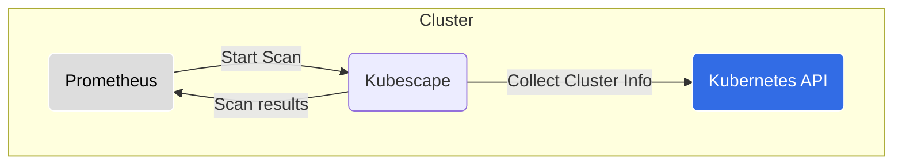

# Kubescape-Prometheus Integration

## This chart is deprecated. Please use the [kubescape-operator](../kubescape-operator/README.md) chart instead.

___

  

## [Docs](https://hub.armosec.io/docs/prometheus-exporter)

Most of the end users either use [`kube-prometheus-stack`](https://github.com/prometheus-community/helm-charts/tree/main/charts/kube-prometheus-stack) prometheus operator else [`prometheus helm chart`](https://github.com/prometheus-community/helm-charts/tree/main/charts/prometheus) to install prometheus for monitoring. Based on your choice of prometheus, you can follow either of the below method to enable kubescape monitoring with Prometheus.  

## Kubescape integration with Kube-Prometheus-stack (Prometheus operator):

1. Install the `kube-prometheus-stack` Helm Chart
```
helm repo add prometheus-community https://prometheus-community.github.io/helm-charts
helm repo update
kubectl create namespace prometheus
helm install -n prometheus kube-prometheus-stack prometheus-community/kube-prometheus-stack --set prometheus.prometheusSpec.podMonitorSelectorNilUsesHelmValues=false,prometheus.prometheusSpec.serviceMonitorSelectorNilUsesHelmValues=false
```

2. Install the `kubescape-prometheus-integrator` Helm Chart

```
helm repo add kubescape https://kubescape.github.io/helm-charts/
helm repo update
helm upgrade --install kubescape-prometheus kubescape/kubescape-prometheus-integrator -n kubescape-prometheus --create-namespace
``` 
---

## Kubescape integration with Prometheus community helm chart:

1. Install the `prometheus-community` Helm Chart
```
helm repo add prometheus-community https://prometheus-community.github.io/helm-charts
helm repo update
kubectl create namespace prometheus
helm install -n prometheus prometheus prometheus-community/prometheus
```

2. Install the `kubescape-prometheus-integrator` Helm Chart with podAnnotations enabled

```
helm repo add kubescape https://kubescape.github.io/helm-charts/
helm repo update
helm upgrade --install kubescape-prometheus kubescape/kubescape-prometheus-integrator -n kubescape-prometheus --set kubescape.prometheusAnnotation.enabled=True --create-namespace 
``` 
---

## [Kubescape](https://github.com/kubescape/kubescape/tree/master/httphandler)

* __Resource Kind:__ `Deployment`
* __Communication:__ REST API
* __Responsibility:__ Runs [Kubescape](https://github.com/kubescape/kubescape) for detecting misconfigurations in the cluster; This is microservice uses the same engine as the Kubescape CLI tool.

### Component Diagram


---

### Adjusting Resource Usage for Your Cluster

By default, Kubescape is configured for small- to medium-sized clusters.
If you have a larger cluster and you experience slowdowns or see Kubernetes evicting components, please revise the amount of resources allocated for the troubled component.

Taking Kubescape for example, we found that our defaults of 500 MiB of memory and 500m CPU work well for clusters up to 1250 total resources.
If you have more total resources or experience resource pressure already, first check out how many resources are in your cluster by running the following command:

```
kubectl get all -A --no-headers | wc -l
```

The command should print an approximate count of resources in your cluster.
Then, based on the number you see, allocate 100 MiB of memory for every 200 resources in your cluster over the count of 1250, but no less than 128 MiB total.
The formula for memory is as follows:
```
MemoryLimit := max(128, 0.4 * YOUR_AMOUNT_OF_RESOURCES)
```

For example, if your cluster has 500 resources, a sensible memory limit would be:
```
kubescape:
  resources:
    limits:
      memory: 200Mi  # max(128, 0.4 * 500) == 200
```
If your cluster has 50 resources, we still recommend allocating at least 128 MiB of memory.

When it comes to CPU, the more you allocate, the faster Kubescape will scan your cluster.
This is especially true for clusters that have a large amount of resources.
However, we recommend that you give Kubescape no less than 500m CPU no matter the size of your cluster so it can scan a relatively large amount of resources fast ;)
 

## Chart support

### Values

| Key | Type | Default | Description |
|-----|------|---------|-------------|
| kubescape.affinity | object | `{}` | Assign custom [affinity](https://kubernetes.io/docs/concepts/scheduling-eviction/assign-pod-node/) rules to the deployment |
| kubescape.downloadArtifacts | bool | `false` | download policies every scan, we recommend it should remain true, you should change to 'false' when running in an air-gapped environment or when scanning with high frequency (when running with Prometheus) |
| kubescape.enableHostScan | bool | `false` | enable [host scanner feature](https://hub.armosec.io/docs/host-sensor) |
| kubescape.enabled | bool | `true` | enable/disable kubescape scanning |
| kubescape.image.repository | string | `"quay.io/kubescape/kubescape"` | [source code](https://github.com/kubescape/kubescape/tree/master/httphandler) (public repo) |
| kubescape.nodeSelector | object | `{}` | [Node selector](https://kubernetes.io/docs/concepts/scheduling-eviction/assign-pod-node/) |
| kubescape.serviceMonitor.enabled | bool | `true` | enable/disable service monitor for prometheus (operator) integration |
| kubescape.serviceMonitor.interval | string | `20m` | Scrape interval |
| kubescape.serviceMonitor.scrapeTimeout | string | `100s` | Adjust to avoid timeout |
| kubescape.prometheusAnnotation.enabled | bool | `false` | add/remove pod annotation for prometheus (non-operator) integration |
| kubescape.volumes | object | `[]` | Additional volumes for Kubescape |
| kubescape.volumeMounts | object | `[]` | Additional volumeMounts for Kubescape |
| kubescape.includeNamespaces | object | `[]` | List of namespaces to include, rest of the namespaces will be ignored. |
| kubescape.excludeNamespaces | object | `[]` | List of namespaces to exclude |
| hostScanner.volumes | object | `[]` | Additional volumes for the host scanner |
| hostScanner.volumeMounts | object | `[]` | Additional volumeMounts for the host scanner |
| awsIamRoleArn | string | `nil` | AWS IAM arn role |
| cloudProviderMetadata.cloudRegion | string | `nil` | cloud region |
| cloudProviderMetadata.gkeProject | string | `nil` | GKE project |
| cloudProviderMetadata.gkeServiceAccount | string | `nil` | GKE service account |
| cloudProviderMetadata.aksSubscriptionID | string | `nil` | AKS subscription ID |
| cloudProviderMetadata.aksResourceGroup | string | `nil` | AKS resource group |
| volumes | object | `[]` | Additional volumes for all containers |
| volumeMounts | object | `[]` | Additional volumeMounts for all containers |
